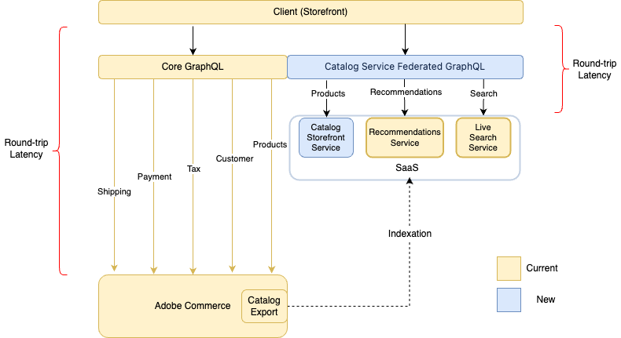

# [!DNL Catalog Service] para Adobe Commerce

La variable [!DNL Catalog Service] para la extensión de Adobe Commerce, proporciona datos de catálogo de modelo de vista enriquecido (solo lectura) para procesar rápida y completamente experiencias de tienda relacionadas con el producto, que incluyen:

* Páginas de detalles del producto
* Páginas de lista y categoría de productos
* Páginas de resultados de búsqueda
* Carruseles de producto
* Páginas de comparación de productos
* Cualquier otra página que represente datos del producto, como las páginas de carro, pedido y lista de deseos

La variable [!DNL Catalog Service] uses [GraphQL](https://graphql.org/) para solicitar y recibir datos del producto. GraphQL es un lenguaje de consulta que un cliente de front-end utiliza para comunicarse con la interfaz de programación de aplicaciones (API) definida en un servidor como Adobe Commerce. GraphQL es un método de comunicación popular porque es ligero y permite que un integrador de sistemas especifique el contenido y el orden de cada respuesta.

Adobe Commerce tiene dos sistemas GraphQL. El sistema principal de GraphQL proporciona una amplia gama de consultas (operaciones de lectura) y mutaciones (operaciones de escritura) que permiten que un comprador interactúe con muchos tipos de páginas, incluidos productos, cuentas de cliente, carro de compras, cierre de compra, etc. Sin embargo, las consultas que devuelven información del producto no están optimizadas para la velocidad. El sistema de servicios GraphQL solo puede realizar consultas sobre productos e información relacionada. Estas consultas tienen un mayor rendimiento que las consultas principales similares.

## Arquitectura

En el diagrama siguiente se muestran los dos sistemas GraphQL:

En el sistema principal de GraphQL, el PWA envía una solicitud a la aplicación Commerce, que recibe cada solicitud, la procesa, posiblemente enviando una solicitud a través de varios subsistemas y, a continuación, devuelve una respuesta a la tienda. Este viaje de ida y vuelta puede causar tiempos de carga de página lentos, lo que puede provocar tasas de conversión más bajas.

[!DNL Catalog Service] es un servicio de pasarela federado de GraphQL. El servicio accede a una base de datos independiente que contiene detalles del producto e información relacionada, como atributos del producto, variantes, precios y categorías. El servicio mantiene la base de datos sincronizada con Adobe Commerce mediante la indexación.
Dado que el servicio evita la comunicación directa con la aplicación, puede reducir la latencia del ciclo de solicitud y respuesta.

>[!NOTE]
>
>La puerta de enlace es para una futura integración con Product Recommendations. En esta versión, puede acceder a la [!DNL Catalog Service Federated GraphQL] y [!DNL Live Search] consultas federadas del mismo extremo si tiene una clave de licencia válida para ambos productos.

Los sistemas principal y de servicio de GraphQL no se comunican directamente entre sí. Puede acceder a cada sistema desde una dirección URL diferente y las llamadas requieren información de encabezado diferente. Los dos sistemas GraphQL están diseñados para utilizarse juntos. La variable [!DNL Catalog Service] El sistema GraphQL aumenta el sistema principal para que las experiencias de tienda de productos sean más rápidas.

Si lo desea, puede implementar [Mesh de API para Adobe Developer App Builder](https://developer.adobe.com/graphql-mesh-gateway/) para integrar los dos sistemas Adobe Commerce GraphQL con API privadas y de terceros y otras interfaces de software mediante Adobe Developer. La red se puede configurar para garantizar que las llamadas enrutadas a cada extremo contengan la información de autorización correcta en los encabezados.

## Detalles arquitectónicos

Las siguientes secciones describen algunas de las diferencias entre los dos sistemas GraphQL.

### Administración de esquemas

Dado que el servicio de catálogo funciona como un servicio, los integradores no necesitan preocuparse por la versión subyacente de Commerce. La sintaxis de las consultas es la misma para todas las versiones. Además, el esquema es coherente para todos los comerciantes. Esta coherencia facilita el establecimiento de prácticas recomendadas y aumenta significativamente la reutilización de las utilidades de tienda.

### Simplificación de los tipos de producto

El esquema reduce la diversidad de tipos de productos a dos casos de uso:

* Los productos simples son los que se definen con un precio y una cantidad únicos. El servicio de catálogo asigna los tipos de producto simples, virtuales, descargables y de tarjetas de regalo a `simpleProductViews`.

* Los productos complejos están compuestos de varios productos simples. El componente productos simples puede tener precios diferentes. También se puede definir un producto complejo para que el comprador pueda especificar la cantidad de productos simples componentes. El servicio de catálogo asigna los tipos de producto configurables, agrupados y agrupados a `complexProductViews`.

Las opciones de productos complejos se unifican y distinguen por su comportamiento, no por el tipo. Cada valor de opción representa un producto simple. Este valor de opción tiene acceso a los atributos de producto simples, incluido el precio. Cuando el comprador selecciona todas las opciones de un producto complejo, la combinación de opciones seleccionadas apunta a un producto simple específico. El producto simple permanece ambiguo hasta que el comprador selecciona un valor para todas las opciones disponibles.

### Precios

Los productos simples representan la unidad de venta base que tiene un precio. El Servicio de Catálogo calcula el precio normal antes de los descuentos, así como el precio final después de los descuentos. Los cálculos de precios pueden incluir impuestos fijos sobre productos. Excluyen las promociones personalizadas.

Un producto complejo no tiene un precio establecido. En su lugar, el Servicio de Catálogo devuelve los precios de las simplificaciones vinculadas. Por ejemplo, un comerciante puede asignar inicialmente los mismos precios a todas las variantes de un producto configurable. Si algunos tamaños o colores no son populares, el comerciante puede reducir los precios de esas variantes. Por lo tanto, el precio del producto complejo (configurable) al principio muestra un rango de precios, reflejando el precio de las variantes estándar y las impopulares. Una vez que el comprador ha seleccionado un valor para todas las opciones disponibles, la tienda muestra un único precio.

## Implementación

El proceso de instalación requiere la configuración del [Conector de Commerce Services](../landing/saas.md). Una vez hecho esto, el siguiente paso es que un integrador de sistemas actualice el código de tienda para incorporar la variable [!DNL Catalog Service] consultas. Todo [!DNL Catalog Service] las consultas se dirigen a la puerta de enlace de GraphQL. La dirección URL se proporciona durante el proceso de incorporación.
