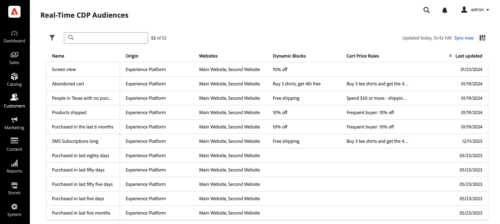

# Crear audiencias en Real-Time CDP con [!DNL Commerce] Datos de evento

Utilice los datos de evento capturados de su [!DNL Commerce] almacene para crear audiencias en Real-Time CDP. Los datos capturados se basan en el comportamiento de navegación, compras anteriores, atributos de perfil, tendencias de conversión o cancelación, estado de lealtad, valor de cliente alto y bajo, etc.

## ¿Qué datos debo considerar al usar?

Cree audiencias en Real-Time CDP con datos de eventos de tienda, back office y perfil.

| Tipos de datos | Datos De Tienda (Eventos De Comportamiento) | Datos del back office (eventos del lado del servidor) | Datos de segmentos y perfil del cliente |
|---|---|---|---|
| **Definición** | Clics o acciones que los clientes realizan en el sitio. | Información sobre el ciclo de vida y detalles de cada pedido (anterior y actual). | Quiénes son sus compradores y para qué segmentos cumplen los requisitos. |
| **Eventos capturados por Adobe Commerce** | [productPageView](events.md#productpageview) [addToCart](events.md#addtocart) | [placeOrder](events.md#completecheckout) [ordenado](events-backoffice.md#orderplaced) [orderLineItemRefund](events-backoffice.md#orderlineitemrefunded) [pedido cancelado](events-backoffice.md#ordercancelled) [historial de pedidos](connect-data.md#send-historical-order-data) | [createAccount](events.md#createaccount) [editAccount](events.md#editaccount) [Registro de perfil](events-profilerecord.md) |

## ¿Qué han conseguido otros clientes?

Adobe [!DNL Commerce] Los clientes de han conseguido un impacto comercial significativo gracias a la activación de audiencias integradas en Real-Time CDP y a su implementación en sus [!DNL Commerce] ejemplo.

Un minorista de ropa global y multimarca logró:

- Una fuente fiable con 10 millones de perfiles de clientes unificados
- Se han creado más de 40 audiencias únicas de &quot;clientes de alta intención&quot; para interactuar con todos los canales

Una compañía global de bebidas recopiló:

- 98 millones de perfiles de clientes de más de 100 países

## Vamos a empezar.

En este artículo, aprenderá lo siguiente:

- Cree una audiencia en Real-Time CDP basada en el [!DNL Commerce] datos que recopilan los eventos
- Active esa audiencia para su [!DNL Commerce] almacenar
- Uso de la audiencia en [!DNL Commerce] para informar una regla de precio del carro de compras

>[!IMPORTANT]
>
>Complete las tareas descritas en este artículo con su [!DNL Commerce] entorno de zona protegida. Esto garantiza que los datos de evento de la tienda y del back office que envía al Experience Platform no diluyan los datos de evento de producción.

### Requisitos previos

Antes de empezar, asegúrese de lo siguiente:

- Se le ha aprovisionado para utilizar Real-Time CDP. Si no está seguro, póngase en contacto con el integrador de sistemas o con el equipo de desarrollo que administra los proyectos y entornos.
- Usted [instalado](install.md) y [configurado](connect-data.md) el [!DNL Data Connection] extensión en [!DNL Commerce].
- Usted [confirmado](connect-data.md#confirm-that-event-data-is-collected) que su [!DNL Commerce] los datos de evento llegan al perímetro del Experience Platform.

### 1. Crear una audiencia

Una audiencia es un conjunto de clientes que comparten un comportamiento o características similares. En este ejercicio, crea una audiencia que clasifica a las personas interesadas en un producto en particular de su tienda.

Para simplificar este ejercicio, utilice los datos de evento del [productPageView](events.md#productpageview) evento. Este evento captura detalles sobre el producto que se visualizó, como el nombre del producto, el SKU, el precio, etc.

Utilice estos datos de evento para especificar que la audiencia incluye personas que tienen al menos un evento de &quot;Vistas del producto&quot; en el que el SKU (identificador de producto) es igual a un producto específico del sitio y el evento se produce en el último día. palo de golf

1. Abra el Experience Platform y seleccione **[!UICONTROL Audiences]** en el menú de navegación izquierdo.

   

1. Clic **[!UICONTROL Create Audience]**.

   

   El **Generador de segmentos** muestra workspace.

1. En el **Generador de segmentos** workspace, seleccione **Generar regla** método de creación.

   

   El **Generador de segmentos** espacio de trabajo es donde se definen las reglas y condiciones de la audiencia&#x200B; Estas reglas y condiciones se basan en datos de evento y perfil de la tienda Commerce y definen los criterios que determinan si un usuario cumple los requisitos para la audiencia. Por ejemplo, puede crear una regla que incluya a los usuarios que han visto un producto específico o a los usuarios que han realizado una compra en un lapso de tiempo determinado. Más información sobre [Generador de segmentos](https://experienceleague.adobe.com/en/docs/experience-platform/segmentation/ui/segment-builder) y las reglas y condiciones.

1. Seleccione el [Eventos](https://experienceleague.adobe.com/en/docs/experience-platform/segmentation/ui/segment-builder#events) pestaña.

   

1. Busque el tipo de evento &quot;Vistas del producto&quot;. A continuación, arrástrela y suéltela en el **Generador de segmentos** workspace.

1. Vuelva a la **Eventos** y busque &quot;SKU&quot;, que es el campo de datos en la `productListItems` field. Arrástrela y suéltela en el **Generador de segmentos** espacio de trabajo sobre **Vista del producto** evento.

   El **Reglas de evento** Esta sección muestra dónde puede especificar el producto específico con el que desea crear la audiencia.

   

1. Establezca el intervalo de tiempo en un día haciendo clic en **En cualquier momento** y seleccionando *En los últimos* con un valor de *1*.

   Al crear una audiencia, puede especificar un intervalo de tiempo para capturar la actividad reciente. La configuración de un intervalo de tiempo permite dirigirse a los usuarios en función de sus interacciones o comportamientos recientes dentro de un periodo de tiempo específico.

1. En el **Propiedades de audiencia** en el lado derecho del espacio de trabajo, defina las propiedades de audiencia proporcionando un nombre, una descripción y un método de evaluación para la audiencia.

1. Para guardar la audiencia, haga clic en **[!UICONTROL Save and Close]**.

   Los detalles de la audiencia se muestran en la **Audiencia** panel.

### 2. Active la audiencia en [!DNL Commerce] destino

La audiencia se puede publicar en [!DNL Commerce] activándolo para el [!DNL Commerce] destino.

>[!IMPORTANT]
>
>Si aún no lo ha hecho [!DNL Commerce] como destino disponible para recibir datos, consulte la [Adobe [!DNL Commerce] Conexión](https://experienceleague.adobe.com/en/docs/experience-platform/destinations/catalog/personalization/adobe-commerce) tema.

1. En el **Detalles** de la audiencia, haga clic en **Activar en destino**.

1. Seleccione su [!DNL Commerce] destino. A continuación, haga clic en **Siguiente**.

1. Complete el proceso de activación haciendo clic en **[!UICONTROL Finish]**.

## 3. Vea la audiencia en el panel de audiencias

Entrada [!DNL Commerce], puede ver todos los [activo](https://experienceleague.adobe.com/en/docs/experience-platform/destinations/ui/activate/activate-edge-personalization-destinations) audiencias que se pueden personalizar para su [!DNL Commerce] instancia con el **Audiencias de Real-Time CDP** panel.

Para acceder a **Audiencias de Real-Time CDP** panel, vaya a _Administrador_ barra lateral y vaya a **[!UICONTROL Customers]** > **[!UICONTROL Real-time CDP Audience]**.

En el tablero, busque la audiencia que ha creado. Tenga en cuenta que no se utiliza en una regla de precios de carro de compras o en un bloque dinámico. En la siguiente sección, vincula la audiencia a una regla de precios del carro de compras.

### 4. Cree una regla de precios de carro basada en la audiencia

Esta sección muestra cómo crear una regla de precios de carro de compras basada en la nueva audiencia.

1. Confirme que la nueva audiencia se muestra en la **Audiencias de Real-Time CDP** panel.
1. [Crear una regla de precios de carro](https://experienceleague.adobe.com/en/docs/commerce-admin/marketing/promotions/cart-rules/price-rules-cart-create).
1. [Configuración de la condición](https://experienceleague.adobe.com/en/docs/commerce-admin/marketing/promotions/cart-rules/price-rules-cart-create#use-real-time-cdp-audiences-to-set-a-condition) de la regla de precio del carro de compras con la nueva audiencia.
1. [Establecer la acción](https://experienceleague.adobe.com/en/docs/commerce-admin/marketing/promotions/cart-rules/price-rules-cart-create#step-3-define-the-actions) que desea que tenga lugar cuando se añada el producto al carro de compras.
1. Continúe configurando la regla de precios del carro de compras.
1. Vaya a la vista del cliente de la instancia de zona protegida.
1. Añada al carro de compras el producto en el que basó la audiencia. Observe que la regla de precios del carro de compras está habilitada.

## Ajustar

En este ejercicio, ha creado una audiencia en Real-Time CDP y la ha activado en [!DNL Commerce] destino. A continuación, en la [!DNL Commerce] administrador, ha creado una regla de precio del carro de compras basada en esa audiencia y ha habilitado la regla en su entorno de zona protegida.
