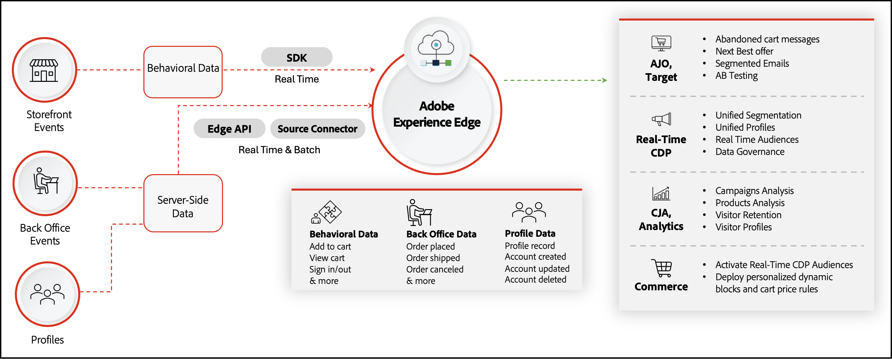

# [!DNL Data Connection] Introducción

>[!IMPORTANT]
>
>Se ha cambiado el nombre del conector del Experience Platform a [!DNL Data Connection].

El [!DNL Data Connection] conecta la instancia web de Adobe Commerce a Adobe Experience Platform y a la red perimetral. Obtenga información sobre cómo [integrar](./mobile-sdk-epc.md) el SDK de Adobe Experience Platform Mobile con Commerce.

Su tienda de Commerce contiene una gran cantidad de datos. La información sobre cómo los compradores exploran, ven y finalmente compran los productos en el sitio puede revelar oportunidades para crear una experiencia de compra más personalizada. Aunque esos datos pueden informar a las funciones nativas de Commerce, como las reglas de precios del carro de compras y los bloques dinámicos, los datos permanecen en silo en la instancia de Commerce.

Adobe Experience Platform proporciona un conjunto de tecnologías que, cuando se hidratan con datos de su tienda de Commerce, pueden distribuir esos datos a través de Edge Network a otros productos DX de Adobe para desbloquear perspectivas sobre el comportamiento de compra de su comprador. Con estas perspectivas profundas, puede crear una experiencia de compra más personalizada en todos los canales.

La siguiente imagen muestra cómo fluyen los datos de Commerce desde su tienda a otros productos DX de Adobe:

En la imagen anterior, los datos de la tienda y del back office se envían al perímetro del Experience Platform mediante un SDK, API y un conector de origen. No es necesario que comprenda completamente cómo funcionan estos fragmentos, ya que la extensión gestiona la complejidad del uso compartido de datos por usted. Cuando los datos de evento se encuentran en el perímetro de, puede extraer esos datos en otras aplicaciones de Experience Platform. Por ejemplo:

| Aplicación | Finalidad | Casos de uso |
|---|---|---|
| [Adobe [!DNL Real-Time CDP]](https://experienceleague.adobe.com/docs/experience-platform/rtcdp/overview.html?lang=es) | Administración de perfiles y servicio de segmentación | **Segmentación del historial de compras**: los comerciantes pueden identificar a los clientes que compran un artículo en función de un período de tiempo específico (mensual, trimestral, anual, etc.). Los comerciantes pueden crear segmentos para estos clientes y segmentarlos para promociones, campañas y anuncios _parte superior del canal_ datos de posibles clientes para servicios de suscripción.  **Segmentación basada en categorías**: los comerciantes pueden ver qué categoría de productos se compraron.  **Segmentación basada en ofertas**: los comerciantes pueden identificar a los clientes que devuelven productos de forma coherente. Las ofertas y descuentos que se les ofrecen ahora pueden ser más inteligentes. Por ejemplo, el envío gratuito se puede eliminar para un cliente que devuelve productos todo el tiempo.  **Segmentación por similitud**: A _Audiencia de similitud_ es una metodología tomada por un comerciante para que sus promociones lleguen a nuevas personas que probablemente estén interesadas en su negocio porque comparten características similares a las de sus clientes existentes. Los segmentos de similitud se pueden crear en función de los datos de comportamiento y transaccionales.  **Tendencia del cliente**: los cambios en el comportamiento de los clientes se pueden identificar como resultado de perfiles de clientes más profundos que se pueden crear a partir de los datos transaccionales. Habrá una mayor confianza en la puntuación de tendencia, ya que hay más datos que fluyen a los cálculos, como devoluciones de productos y configuraciones de productos.  **Venta cruzada**: un comerciante puede identificar oportunidades potentes de venta cruzada y de mejora de ventas a partir de la información granular recopilada en Commerce. |
| [Cliente [!DNL Journey Analytics]](https://experienceleague.adobe.com/docs/analytics-platform/using/cja-overview/cja-overview.html) | Análisis profundo del recorrido completo de Commerce | **Tendencias estacionales**: Un comerciante puede identificar tendencias estacionales, lo que le ayuda a prepararse para el cambio periódico en la demanda de productos específicos. Además, los comerciantes pueden identificar cambios en la popularidad general de cualquier producto a lo largo de los años.  **Análisis de conversión**: Al saber cuándo se compró un producto, junto con el acceso a los eventos de impresión de tienda, los comerciantes pueden generar un perfil enriquecido del cliente para realizar análisis de conversión. |
| [Adobe [!DNL Analytics]](https://experienceleague.adobe.com/docs/analytics/analyze/admin-overview/analytics-overview.html) | Análisis profundo del comportamiento del cliente y el rendimiento de la campaña | **Devoluciones de pedidos**: los comerciantes pueden identificar a los clientes y a los segmentos de clientes más grandes que tienen un patrón de productos de retorno. Esto ayuda a los comerciantes a mejorar su estrategia comercial a medida que comprenden el aspecto de su comportamiento de base de clientes.  **Dirección del pedido**: En función de la dirección de envío, un comerciante puede comprender si los pedidos los realizan los propios clientes o si es para otra persona o entidad.  **Tendencias de estacionalidad**: Un comerciante puede identificar tendencias estacionales, lo que le ayuda a prepararse para el cambio periódico en la demanda de productos específicos. Además, los comerciantes pueden identificar cambios en la popularidad general de cualquier producto a lo largo de los años.  **Análisis de conversión**: Al saber cuándo se compró un producto, junto con el acceso a los eventos de impresión de tienda, los comerciantes pueden generar un perfil enriquecido del cliente para realizar análisis de conversión. **Nota** Adobe Analytics solo admite datos de evento de comportamiento (tienda). Adobe Analytics no admite datos de evento transaccionales (de back-office). |
| [Adobe [!DNL Journey Optimizer]](https://experienceleague.adobe.com/docs/journey-optimizer/using/get-started/get-started.html) | Organización de campañas en varios canales | **Recorridos basados en el comportamiento**: Los comerciantes pueden dirigirse a un cliente que compró un teléfono móvil hace dos años sugiriendo que compre el nuevo modelo. Los comerciantes pueden crear campañas y promociones personalizadas para estos clientes y utilizar la funcionalidad de correo electrónico y SMS para ponerse en contacto con. Además, los comerciantes pueden utilizar datos de comportamiento y orden históricos para identificar tendencias. Por ejemplo, un cliente que ha comprado un artículo con una configuración particular en el pasado y ahora quiere comprar de nuevo el mismo producto, puede mejorar su recorrido de compra ofreciéndole visibilidad y acceso a las mismas configuraciones de producto.  **Personalización**: con acceso a la información de perfil del cliente, [!DNL Journey Optimizer] puede desbloquear recorridos altamente personalizados, lo que permite a los comerciantes llegar a los clientes en diferentes canales.  **Nuevo perfil creado**: los correos electrónicos de bienvenida y las actividades promocionales pueden alentar e influir en los nuevos clientes en sus recorridos de compra.  **Perfil eliminado**: los comerciantes pueden optar por dejar de enviar correos electrónicos promocionales a los clientes que han cerrado su cuenta. Como alternativa, los comerciantes también pueden crear campañas para recuperar clientes perdidos. |

## Recuperar los datos del Experience Platform en Commerce

Envío de los datos de Commerce al Experience Platform mediante [!DNL Data Connection] La extensión de es una cara de las capacidades de uso compartido de datos de Commerce. El otro lado, que es una extensión opcional, se llama [Audience Activation](https://experienceleague.adobe.com/docs/commerce-admin/customers/audience-activation.html). Esta extensión le permite crear audiencias en Real-Time CDP e implementarlas en su tienda de Commerce para informar las reglas de precios del carro de compras y los bloques dinámicos.

En un nivel superior, el flujo de datos desde la tienda de Commerce al Experience Platform y a través de la extensión del Audience Activation tiene el siguiente aspecto:

![[!DNL Data Connection] fluir](assets/data-connection.png)

Después de configurar la conexión entre Commerce y Experience Platform y Experience Platform de Commerce, los datos siguen fluyendo. No es necesario que vuelva a conectarse, a menos que así lo requiera una actualización.

## Conceptos

Para compartir datos entre estos dos sistemas, es necesario comprender varios conceptos.

* **Datos** : los datos que se comparten con el Experience Platform son los datos recopilados de los eventos del explorador en la tienda y los eventos del back office en el servidor. Los eventos de tienda se capturan a partir de las interacciones de los compradores en el sitio e incluyen eventos como [`addToCart`](events.md#addtocart), [`pageView`](events.md#pageview), [`createAccount`](events.md#createaccount), [`editAccount`](events.md#editaccount), [`startCheckout`](events.md#startcheckout), [`completeCheckout`](events.md#completecheckout), [`signIn`](events.md#signin), [`signOut`](events.md#signout), etc. Consulte [eventos de tienda](events.md#storefront-events) para obtener la lista completa de eventos de tienda. Los eventos del lado del servidor o de back office incluyen [estado del pedido](events.md#back-office-events) información, como [`orderPlaced`](events.md#orderplaced), [`orderReturned`](events.md#orderitemreturncompleted), [`orderShipped`](events.md#ordershipmentcompleted), [`orderCancelled`](events.md#ordercancelled), etc. Consulte [eventos de back office](events.md#back-office-events) para obtener la lista completa de eventos de back office.

* **Experience Platform y red perimetral** - El almacén de datos para la mayoría de los productos DX de Adobe. Los datos enviados al Experience Platform se propagan a los productos DX de Adobe a través de la red perimetral de Experience Platform. Por ejemplo, puede iniciar Journey Optimizer, recuperar los datos específicos del evento de comercio de Edge y crear un correo electrónico de carro de compras abandonado en Journey Optimizer. A continuación, Journey Optimizer puede enviar ese correo electrónico si hay carros de compras abandonados en su tienda de Commerce. Obtenga más información acerca de [Experience Platform y Edge Network](https://experienceleague.adobe.com/docs/platform-learn/data-collection/web-sdk/overview.html).

* **Esquema** : el esquema es lo que describe la estructura de los datos que se envían. Antes de que Experience Platform pueda introducir los datos de Commerce, debe crear un esquema para describir la estructura de los datos y proporcionar restricciones al tipo de datos que se pueden contener en cada campo. Los esquemas constan de una clase base y cero o más grupos de campos de esquema. El esquema utiliza la estructura XDM, que todos los productos DX de Adobe pueden leer. Por lo tanto, cuando envíe sus datos al Experience Platform, puede estar seguro de que sus datos se entienden en todos los productos DX. Más información sobre [esquemas](https://experienceleague.adobe.com/docs/experience-platform/xdm/home.html).

* **Conjunto de datos** : construcción de almacenamiento y administración para una colección de datos, normalmente una tabla que contiene un esquema (columnas) y campos (filas). Los conjuntos de datos también contienen metadatos que describen varios aspectos de los datos que almacenan. Todos los datos que se incorporan correctamente a Adobe Experience Platform están contenidos en conjuntos de datos. Más información sobre [conjuntos de datos](https://experienceleague.adobe.com/docs/experience-platform/catalog/datasets/overview.html).

* **Datastream** : ID que permite que los datos fluyan desde Adobe Experience Platform a otros productos DX de Adobe. Este ID debe estar asociado a un sitio web específico dentro de la instancia de Adobe Commerce específica. Cuando cree este flujo de datos, especifique el esquema XDM que ha creado anteriormente. Más información sobre [flujos de datos](https://experienceleague.adobe.com/docs/experience-platform/datastreams/overview.html).

## Arquitectura admitida

El [!DNL Data Connection] La extensión de está disponible en las siguientes arquitecturas:

* PHP/Luma
* [PWA Studio](https://developer.adobe.com/commerce/pwa-studio/integrations/adobe-commerce/aep/)
* [AEM](https://experienceleague.adobe.com/docs/experience-manager-cloud-service/content/content-and-commerce/integrations/aep.html)

## Requisitos previos

Para usar la variable [!DNL Data Connection] Extensión, debe tener lo siguiente:

* Adobe Commerce 2.4.4 o posterior
* Adobe ID e ID de organización
* [Capa de datos del cliente de Adobe (ACDL)](https://experienceleague.adobe.com/docs/experience-platform/tags/extensions/client/client-data-layer/overview.html), necesaria para recopilar datos de evento de tienda
* Derechos a otros productos DX de Adobe.

## Pasos de incorporación

En un nivel superior, lo que permite [!DNL Data Connection] La extensión de implica los siguientes pasos:

1. [Instalar](install.md) el [!DNL Data Connection] extensión.
1. [Iniciar sesión](https://helpx.adobe.com/manage-account/using/access-adobe-id-account.html) a su cuenta de Adobe y [ver para confirmar](https://experienceleague.adobe.com/docs/core-services/interface/administration/organizations.html#concept_EA8AEE5B02CF46ACBDAD6A8508646255) su ID de organización. El ID de organización es el ID asociado con la empresa de Experience Cloud aprovisionada. Se trata de una cadena alfanumérica de 24 caracteres seguida de (que debe incluirse) `@AdobeOrg`.
1. [Crear o actualizar](update-xdm.md) Cree su esquema XDM con grupos de campos específicos de Commerce.
1. [Crear un conjunto de datos](https://experienceleague.adobe.com/docs/platform-learn/implement-mobile-sdk/experience-cloud/platform.html#create-a-dataset) en función del esquema que haya creado o actualizado. Este conjunto de datos contiene los datos de Commerce que envía.
1. [Creación de una secuencia de datos](https://experienceleague.adobe.com/docs/experience-platform/datastreams/overview.html) y seleccione el esquema XDM que contiene los grupos de campos específicos de Commerce.
1. [Conectar con Commerce Services](../landing/saas.md).
1. [Conectar con Adobe Experience Platform](connect-data.md).

El resto de esta guía le explica todos estos pasos con más detalle para que pueda ponerse al día y comenzar a utilizar la potencia de los productos Adobe DX en su tienda de Commerce.

>[!NOTE]
>
>Para desarrolladores móviles, aprenda a [integrar](./mobile-sdk-epc.md) el SDK de Adobe Experience Platform Mobile con Commerce.

## Público

Esta guía está diseñada para el comerciante de Adobe Commerce que desea enriquecer y personalizar su tienda de Commerce para mejorar la experiencia de compra de sus clientes.

## Asistencia

Si necesita información o tiene preguntas que no se tratan en esta guía, utilice los siguientes recursos:

* [Centro de ayuda](https://experienceleague.adobe.com/docs/commerce-knowledge-base/kb/overview.html){target="_blank"}
* [Tickets de asistencia](https://experienceleague.adobe.com/docs/commerce-knowledge-base/kb/help-center-guide/magento-help-center-user-guide.html#submit-ticket){target="_blank"}—Envíe un ticket para recibir ayuda adicional.
