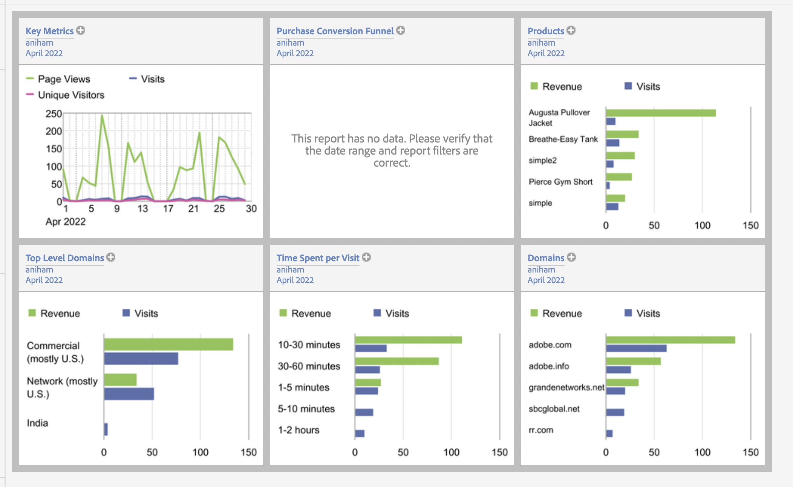

# Conexión de datos de Commerce a Adobe Experience Platform {#connectaep}

Para conectar la instancia de Adobe Commerce a Adobe Experience Platform, debe proporcionar un ID de organización y un ID de almacén de datos.

## General

1. Inicie sesión en su cuenta de Adobe en [Conector de Commerce Services](../landing/saas.md#organizationid) y seleccione su ID de organización.

1. En el Administrador, vaya a **Sistema** > Servicios > **Conector del Experience Platform**.

1. En el **Ámbito** menú desplegable, establezca el contexto en **Sitio web**.

1. En el **ID de organización** , verá el ID asociado a su cuenta de Adobe Experience Platform, tal como se configura en la variable [Conector de Commerce Services](../landing/saas.md#organizationid). El ID de organización es global. Solo se puede asociar un ID de organización por cada instancia de Adobe Commerce.

1. (Opcional) Si ya tiene un [SDK web de AEP (alloy)](https://experienceleague.adobe.com/docs/experience-platform/edge/home.html) implementado en su sitio, active la casilla de verificación y añada el nombre del SDK web de AEP. De lo contrario, deje estos campos en blanco y el conector del Experience Platform se implementará por usted.

   >[!NOTE]
   >
   >Si especifica su propio SDK web de AEP, el conector del Experience Platform utiliza el ID del conjunto de datos asociado a dicho SDK y no el ID del conjunto de datos especificado en esta página (si existe).

## Recopilación de datos

>[!NOTE]
>
>Para los comerciantes ya inscritos en nuestro programa beta de back office, verá una casilla de verificación para habilitar eventos de back office. Si desea participar en el programa beta de back office, póngase en contacto con [drios@adobe.com](mailto:drios@adobe.com).

En el **Recopilación de datos** , especifique qué tipos de datos desea recopilar y enviar al borde del Experience Platform. De forma predeterminada, los eventos de tienda se envían automáticamente siempre que el SDK web de AEP y el ID de organización sean válidos. Consulte el tema de eventos para obtener más información sobre [storefront](events.md#storefront-events) y [back office](events.md#beta-order-status-events) eventos.

>[!NOTE]
>
>Todos los campos de la **Recopilación de datos** se aplican a la sección **Sitio web** o superior.

1. Select **Eventos de back office** si desea enviar la información de estado del pedido, por ejemplo, si se ha realizado, cancelado, reembolsado o enviado un pedido.

   >[!NOTE]
   >
   >De forma predeterminada, todos los datos de back office se envían al perímetro del Experience Platform. Si un comprador decide excluirse de la recopilación de datos, debe establecer explícitamente la preferencia de privacidad del comprador en el Experience Platform. Esto es diferente de los eventos de tienda en los que el recolector ya gestiona el consentimiento en función de las preferencias del comprador. [Más información](https://experienceleague.adobe.com/docs/experience-platform/landing/governance-privacy-security/consent/adobe/dataset.html) acerca de la configuración de la preferencia de privacidad de un comprador en el Experience Platform.

1. (Omita este paso si utiliza su propio SDK web de AEP). [Crear](https://experienceleague.adobe.com/docs/experience-platform/edge/datastreams/configure.html#create) un conjunto de datos en Adobe Experience Platform o seleccione un conjunto de datos existente que desee utilizar para la recopilación.

1. (Omita este paso si utiliza su propio SDK web de AEP). En el **ID de almacén de datos** , pegue el ID de ese conjunto de datos nuevo o existente.

## Descripciones de campos

| Campo | Descripción |
|--- |--- |
| Ámbito | Sitio web específico al que desea aplicar la configuración. |
| ID de organización (global) | ID que pertenece a la organización que compró el producto Adobe DX. Este ID vincula la instancia de Adobe Commerce con Adobe Experience Platform. |
| ¿El SDK web de AEP ya está implementado en su sitio? | Seleccione esta casilla de verificación si ha implementado su propio SDK web de AEP en su sitio |
| Nombre del SDK web de AEP (global) | Si ya tiene un SDK web Experience Platform implementado en su sitio, especifique el nombre de ese SDK en este campo. Esto permite que el recopilador de eventos de tienda y el SDK de evento de tienda utilicen su SDK web de Experience Platform en lugar de la versión implementada por el conector del Experience Platform. Si no tiene un SDK web de Experience Platform implementado en su sitio, deje este campo en blanco y el conector de Experience Platform implemente uno por usted. |
| Eventos de tienda | Se selecciona de forma predeterminada siempre que el ID de organización y el ID de flujo de datos sean válidos. Los eventos de tienda recopilan datos de comportamiento anónimos de sus compradores a medida que navegan por el sitio. |
| Eventos de Back Office (Beta) | Si se selecciona, la carga útil de evento contiene información de estado de pedido anónima, como si se ha realizado, cancelado, reembolsado o enviado un pedido. |
| ID de almacén de datos (sitio web) | ID que permite el flujo de datos de Adobe Experience Platform a otros productos DX de Adobe. Este ID debe estar asociado a un sitio web específico de la instancia de Adobe Commerce específica. Si especifica su propio SDK web de Experience Platform, no especifique un ID de conjunto de datos en este campo. El conector del Experience Platform utiliza el ID del almacén de datos asociado a dicho SDK e ignora cualquier ID del almacén de datos especificado en este campo (si existe). |

Con la extensión del conector del Experience Platform instalada, el vínculo entre Adobe Commerce y Adobe Experience Platform creado y el ID de almacén de datos especificado, los datos de comercio empiezan a fluir al borde de Adobe Experience Platform y a otros productos DX de Adobe.

>[!NOTE]
>
> La cantidad de tiempo que tardan los datos en fluir desde el borde a otros productos DX de Adobe puede variar.

## Datos de comercio en el extremo

Cuando los datos de comercio se envían al perímetro de Adobe Experience Platform, puede crear informes como los siguientes:

_Datos de comercio en Adobe Experience Manager_
