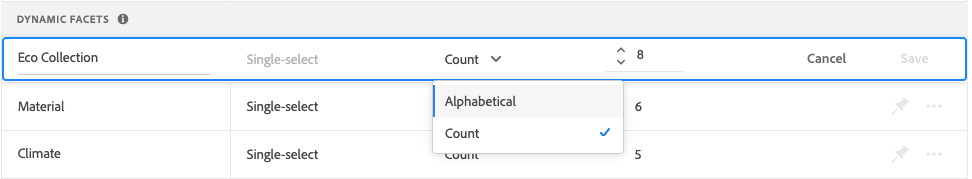

# Administrar facetas

Siga estas instrucciones para actualizar las propiedades de las facetas existentes o cambiar su presentación en la tienda.

## Configurar agrupaciones de facetas de precios

Consulte [Configuración](settings.md) para configurar intervalos y agrupaciones de facetado de precios.

## Editar faceta

1. Busque la faceta que desee editar.
1. Si hay muchas facetas en la lista, establezca *Filtrar por* a uno de los siguientes:

   * Anclado
   * Dinámico

   Para obtener más información, vaya a [Tipos de faceta](facets-type.md).

   

1. Para editar las propiedades de faceta, haga clic en **Más** (...) opciones.
1. Clic **Editar**

   

1. Para editar la etiqueta de faceta, realice una de las siguientes acciones:

   * Para un [!DNL Commerce] tienda, edite el [etiqueta de atributo](https://experienceleague.adobe.com/docs/commerce-admin/catalog/product-attributes/product-attributes.html).
   * Para una implementación sin encabezado, haga clic en el valor de la primera columna y edite el texto según sea necesario.

   

1. (Solo Headless) Para cambiar el método que se utiliza para ordenar los valores de faceta, haga clic en el valor en la variable *Tipo de orden* y elija una de las siguientes opciones:

   * Alfabético
   * Recuento

   

1. En el **Valor máximo** establezca el número máximo (de 0 a 10) de valores de filtro de faceta que se mostrarán en la tienda.
1. Cuando termine, haga clic en **Guardar**.
Los cambios no aparecerán en la tienda hasta que se publiquen.

## Fijar/desanclar faceta

El pin cambia de color cuando se pulsa y se utiliza para mover la faceta a *Facetas ancladas* o el *Facetas dinámicas* sección.

1. Para anclar una faceta a la parte superior del *Filtros* , busque la faceta en la lista *Facetas dinámicas* y haga clic en el pin gris ().
El pin se vuelve azul y la faceta se mueve a la *Facetas ancladas* sección.
1. Para desanclar una faceta, busque la faceta en el *Facetas ancladas* y haga clic en el pin azul ().
El pasador se vuelve gris y la faceta se mueve a la *Facetas dinámicas* sección.

   

>[!NOTE]
>
>El orden de facetas anclado puede ser incoherente si hay dos etiquetas con el mismo nombre.

## Mover faceta anclada

>[!NOTE]
>
>El orden de las facetas ancladas solo se admite en implementaciones sin encabezado. Si son necesarias facetas ordenadas, utilice el [!DNL Live Search] Widget PLP.

El orden de las facetas ancladas se puede cambiar moviendo la fila a una posición diferente. Las facetas ancladas tienen un *Mover* icono () al principio de la fila. A diferencia de las facetas ancladas, las facetas dinámicas no se pueden mover.

1. Busque la faceta en la *Facetas ancladas* de la lista.
1. Utilice el **Mover** () para arrastrar la fila a una nueva posición en el *Facetas ancladas* sección.
Una vez publicados los cambios, las facetas reordenadas aparecen en la tienda *Filtros* lista.

## Eliminar faceta

1. Busque la faceta en la lista y haga clic en **Más** (...) opciones.
1. Clic **Eliminar**.
1. Cuando se le pida que confirme, haga clic en **Eliminar faceta**.
La faceta se eliminará de la tienda una vez publicados los cambios.

## Publicar cambios

1. Para actualizar la tienda con los cambios, haga clic en **Publicar cambios**.
1. Espera unos 15 minutos para que las actualizaciones aparezcan en tu tienda.
