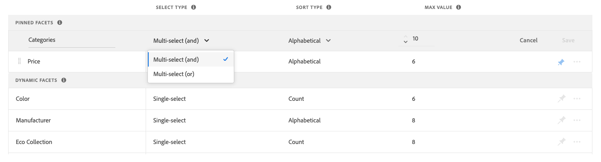

# Tipos de facetas

Todo [!DNL Live Search] las facetas son dinámicas y aparecen en la *Filtros* solo cuando corresponda. La lista de facetas disponibles cambia según los productos devueltos. Las siguientes características afectan a su presentación y comportamiento:

* Facetas fijadas : las facetas más utilizadas se pueden fijar en la parte superior de la lista. Las facetas restantes se enumeran en *Tipo de ordenación* orden después de las facetas fijadas.
* Facetas inteligentes: atributos de producto que [Adobe Sensei](https://www.adobe.com/sensei.html) encuentra más relevante para un conjunto de productos y una consulta. El cálculo tiene en cuenta los metadatos de atributo de todo el catálogo y determina en el momento de la consulta las facetas más relevantes para la consulta.
* Facetas populares : atributos de producto que están presentes con mayor frecuencia en los resultados de búsqueda.
* Facetas de precio - Devolver productos por rango de precios. Puede especificar el número de selecciones y el intervalo de intervalo de precios en la variable [*Configuración*](settings.md) pestaña .

En tiempo de consulta, [!DNL Live Search] genera los resultados de búsqueda en grupos de facetas inteligentes y populares.

## Tienda y opciones sin encabezado

Facetas que se representan para la variable [!DNL Commerce] el adaptador de búsqueda procesa la tienda, que enruta las solicitudes y procesa los resultados en la tienda. Todo [!DNL Commerce] las facetas de tienda se ordenan alfabéticamente con opciones de selección única, independientemente del tipo de entrada asignado al atributo correspondiente. Las facetas disponibles en la tienda se representan según el tema actual y reflejan cualquier personalización hecha a la presentación de la navegación en capas.

En contraste, [headless](https://devdocs.magento.com/guides/v2.4/architecture/archi_perspectives/webapi-vision.html) la API procesa las implementaciones de y admite opciones adicionales. Las facetas sin encabezado se pueden ordenar alfabéticamente o por recuento y pueden tener opciones de selección única o múltiple.

### Seleccionar tipo

Para implementaciones sin encabezado, las facetas se pueden definir como `single select` o `multi-select` con operadores lógicos que determinan el conjunto de productos devuelto. Por ejemplo, `green AND blue` o `green OR blue`.

| Seleccionar tipo | Descripción |
|--- |--- |
| Selección única | Una faceta de selección única ofrece varias opciones, pero permite que el comprador elija solo un valor. |
| Selección múltiple (o) | (Solo sin encabezado) Los compradores pueden elegir más de una opción y los productos devueltos pueden coincidir con cualquier valor seleccionado. Ejemplo: `green OR blue` |
| Selección múltiple (y) | (Solo sin encabezado) Los compradores pueden elegir más de una opción y los productos devueltos deben coincidir con todos los valores seleccionados. Ejemplo: `green AND blue` |

### Etiquetas de facetas

Para [!DNL Commerce] tienda, la etiqueta de faceta está determinada por el [*Propiedades de atributo*](https://docs.magento.com/user-guide/stores/attribute-product-create.html). Para tiendas con varias vistas, se pueden definir etiquetas adicionales en *Administrar etiquetas*. Para implementaciones sin encabezado, las etiquetas se editan desde el [espacio de trabajo de facetas](faceting-workspace.md).

### Tipo de ordenación

Todas las facetas representadas para la tienda se ordenan alfabéticamente. En implementaciones sin encabezado, las facetas se pueden ordenar alfabéticamente o por recuento.

| Tipo de ordenación | Descripción |
|--- |--- |
| Alfabético | En la tienda *Filtros* , las facetas se ordenan alfabéticamente. |
| Recuento | (Solo sin encabezado) En implementaciones sin encabezado, las facetas también se pueden ordenar por el número de valores encontrados por faceta en el conjunto actual de productos devueltos. |
