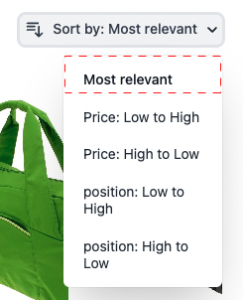
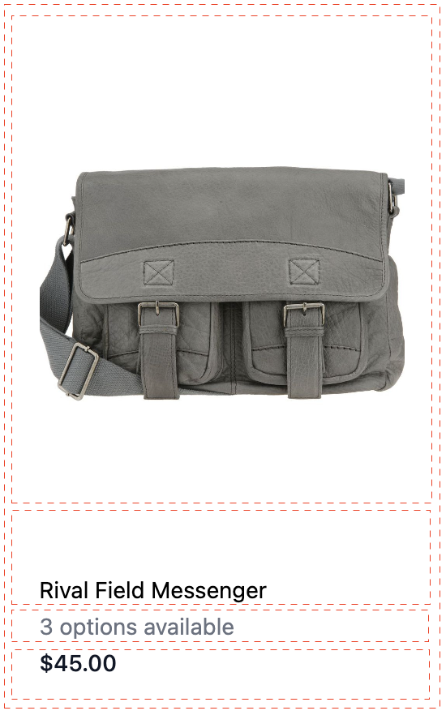

# Widget de página de lista de productos

El [!DNL Live Search Product Listing Page Widget] (PLP) utiliza la plataforma de Commerce Services para proporcionar una página de lista de productos con un buen rendimiento, en la que se pueden realizar búsquedas y facetas. En este tema se describe cómo habilitar y aplicar estilo al widget PLP.

## Activación del widget PLP

Si la variable [!DNL Live Search] Cuando el servicio de está instalado, la funcionalidad de búsqueda predeterminada se convierte en [!DNL Live Search] automáticamente.
El widget PLP debe estar habilitado en Admin.

1. Ir a **Tiendas** > Configuración > **Configuración** > **[!DNL Live Search]** > **Características de tienda** y establecer **Activar widgets de lista de productos** a &quot;Sí&quot;.
1. Seleccionar **Guardar configuración** para guardar la configuración.

## Ejemplo de estilo

Puede personalizar el aspecto del widget PLP para que coincida con su sitio mediante [CSS](https://developer.adobe.com/commerce/frontend-core/guide/css/).

>[!NOTE]
>
>Los elementos con clases personalizadas dentro de una temática de Adobe Commerce no se heredan. Estos elementos deben estar dirigidos por su clase específica para que coincidan con las clases personalizadas; las clases de acción principales no funcionarán en un botón de widget.
>Se heredarán los elementos de destino genéricos dentro de CSS; `button` se aplicará a los botones del widget.

Los divs resaltados contienen la clase de destino `ds-sdk-product-item__product-name`.


Personalice el nombre del producto añadiendo una regla para que esté en mayúsculas.

```css
.ds-sdk-product-item__product-name {
 text-transform: uppercase;
}
```


## Clases CSS

### Lista de productos

* `.ds-sdk-product-list`: div externo
* `.ds-sdk-product-list__grid`: div interno


#### Paginación de lista de productos

* `.ds-plp-pagination`


* `.ds-plp-pagination_item`


* `.ds-plp-pagination_item--current`


### Widgets

* `.ds-widgets`: div externo
* `.ds-widgets__actions`: div interior del lado izquierdo
* `.ds-widgets__results`: div interior del lado derecho


### Lista desplegable Ordenar

* `.ds-sdk-sort-dropdown`


* `.ds-sdk-sort-dropdown__button`


* `.ds-sdk-sort-dropdown__items`


* `.ds-sdk-sort-dropdown__items--item`


* `.ds-sdk-sort-dropdown__items--item-selected`



* `.ds-sdk-sort-dropdown__items--item-active`


### Facetas

* `.ds-plp-facets`
* `.ds-plp-facets__header`
* `.ds-plp-facets__header_title`
* `.ds-plp-facets__header__clear-all`

{width="350"}

* `.ds-plp-facets__pills`
* `.ds-sdk-pill`

{width="350"}

* `.ds-sdk-pill__label`
* `.ds-sdk-pill__cta`

{width="350"}

* `.ds-plp-facets__list`

{width="350"}

* `.ds-sdk-input`
* `.ds-sdk-input__label`
* `.ds-sdk-input__options`
* `.ds-sdk-input_fieldset_show-more`


* `.ds-sdk-labelled-input`


* `.ds-sdk-labelled-input__input`
* `.ds-sdk-labelled-input__label`


### Elemento de producto

* `.ds-sdk-product-item`
* `.ds-sdk-product-item__image`
* `.ds-sdk-product-item__product-name`
* `.ds-sdk-product-item__product-options`
* `.ds-sdk-product-price`
   * `.ds-sdk-product-price--no-discount`
   * `.ds-sdk-product-price--grouped`
   * `.ds-sdk-product-price--bundle`
   * `.ds-sdk-product-price--discount`



### Cargando

* `.ds-sdk-loading`
* `.ds-sdk-loading__spinner`
* `.ds-sdk-loading__spinner-label`


