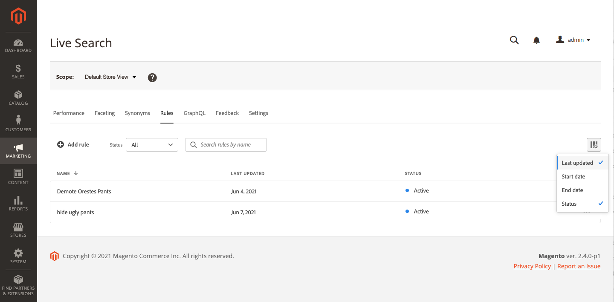

# Espacio de trabajo de reglas

El espacio de trabajo de reglas enumera la selección actual de reglas y su estado, y proporciona acceso a las herramientas necesarias para crear y administrar reglas. Desde el espacio de trabajo puede:

* Buscar reglas
* Ver detalles de reglas
* Activar/desactivar reglas
* Eliminar reglas
* Acceso al editor de reglas

## Establecer el ámbito

Si la instalación de Adobe Commerce incluye varias vistas de tiendas, establezca **Ámbito** a [vista de tienda](https://experienceleague.adobe.com/docs/commerce-admin/start/setup/websites-stores-views.html#scope-settings) donde se aplican sus reglas.

## Mostrar u ocultar columnas

1. En la esquina superior derecha, haga clic en **Mostrar/ocultar**  columnas.
Las columnas visibles tienen una marca de verificación azul en el menú de opciones. El nombre de la regla es la única columna que no se puede ocultar.

   

1. En el menú , realice una de las acciones siguientes:

   * Para mostrar una columna oculta, haga clic en cualquier nombre de columna sin marca de verificación.
   * Para ocultar una columna visible, haga clic en cualquier nombre de columna con una marca de verificación.

   

## Filtrar reglas por estado

1. Si la tienda tiene muchas reglas, puede filtrar las reglas por estado para abreviar la lista. De forma predeterminada, la lista Reglas muestra todas las reglas.

   

1. Para enumerar solo reglas con una configuración de estado específica, establezca **Estado** a uno de los siguientes:

   * Todo
   * Activo
   * Inactivo
   * Programado

   

## Buscar reglas por nombre

Empiece a escribir el nombre de la regla o cualquier palabra del nombre de la regla.
Buscar encuentra las reglas coincidentes a medida que escribe. La cadena de caracteres coincidentes se resalta en el nombre de cada regla encontrada.

## Ver detalles

El panel de detalles muestra el nombre de la regla, el estado, las condiciones y los eventos, la fecha de inicio y finalización, la descripción y la fecha de la última edición. Las reglas se pueden habilitar, editar y eliminar del panel de detalles.

1. En el *Reglas* , busque la regla en la cuadrícula que desee ver y haga clic en **Más** (...).
1. Haga clic en **Ver detalles**.
Puede realizar cualquiera de las siguientes acciones desde el panel Detalles de la vista :

   * Editar regla
   * Eliminar regla
   * Activar/Desactivar regla

1. Para cerrar el *Ver detalles* panel, haga clic en **Cerrar** (X) en la esquina superior derecha.

   

## Descripciones de columnas

| Columna | Descripción |
|--- |--- |
| Nombre | Nombre de la regla. |
| Última actualización | La fecha en que se actualizó por última vez la regla. |
| Fecha de inicio | La fecha de inicio de una regla programada. |
| Fecha final | La fecha de finalización de una regla programada. |
| Estado | El estado codificado por colores indica el estado actual de la regla. Utilice el control Status situado encima de la cuadrícula para filtrar las reglas por estado. Valores: Todo el estado : muestra todas las reglas independientemente del estado. Activo (azul): muestra solo las reglas activas. Programado (naranja): muestra solo las reglas programadas. Inactivo (gris): muestra solo las reglas inactivas. |

## Controles

| Control | Descripción |
|--- |--- |
| Agregar regla | Abre el [editor de reglas](rules-add.md). |
| Estado | Filtra la lista de reglas por estado. Opciones: Todos, Activo, Inactivo, Programado |
|  | Especifica las columnas visibles en la cuadrícula. Opciones: Última actualización, Fecha de inicio, Fecha de finalización, Estado |
| Buscar | Busca una regla con nombre completo o coincidencia parcial. |
|  | Muestra un menú de más acciones que se pueden aplicar a la regla seleccionada. Opciones: Editar, Ver detalles, Eliminar |

## Detalles de reglas

| Campo | Descripción |
|--- |--- |
| Estado | Estado actual de la regla. |
| Condiciones | La consulta de búsqueda que describe las condiciones asociadas a la regla. |
| Fecha de inicio | La fecha en la que la regla entra en vigor, si está programada. |
| Fecha final | La fecha en la que caduca la regla, si está programada. |
| Descripción | Una breve descripción de la regla. |
| Última actualización | Fecha y hora en que se actualizó por última vez la regla. |
| Habilitado | Control que cambia el estado de la regla. Opciones: Habilitado/Deshabilitado |
