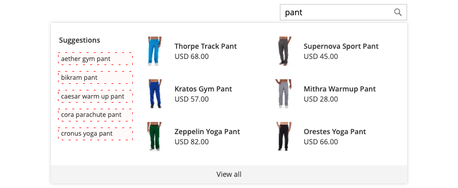

# Diseño de elementos emergentes

La variable [ventana emergente de tienda](storefront-popover.md) muestra siempre el producto `name` y `price`, y la selección de campos no se puede configurar. Sin embargo, los elementos emergentes se pueden diseñar utilizando clases CSS. Por ejemplo, las siguientes declaraciones cambian el color de fondo del contenedor y del pie de página de la ventana emergente.

```css
.livesearch.popover-container {
    background-color: lavender;
}

.livesearch.view-all-footer {
    background-color: magenta;
}
```

## Visibilidad del contenedor

El componente principal del `.livesearch.popover-container` es `.search-autocomplete`.  La variable `.active` indica la visibilidad del contenedor. La variable `.active` se añade condicionalmente cuando la ventana emergente está abierta.

```css
.search-autocomplete.active   /* visible */
.search-autocomplete          /* not visible */
```

Para obtener más información sobre el estilo de los elementos de tienda, consulte [Hojas de estilo en cascada (CSS)](https://devdocs.magento.com/guides/v2.4/frontend-dev-guide/css-topics/css-overview.html) en el [Guía para desarrolladores de Frontend](https://devdocs.magento.com/guides/v2.4/frontend-dev-guide/bk-frontend-dev-guide.html).

## Selectores de clases

Los siguientes selectores de clase se pueden utilizar para aplicar estilo a los elementos de contenedor, sugerencia y producto de la ventana emergente.

* `.livesearch.popover-container`
* `.livesearch.view-all-footer`
* `.livesearch.suggestions-container`
* `.livesearch.suggestions-header`
* `.livesearch.suggestion`
* `.livesearch.products-container`
* `.livesearch.product-result`
* `.livesearch.product-name`
* `.livesearch.product-price`

### Selectores de clase de contenedor

`.livesearch.popover-container`


`.livesearch.view-all-footer`


### Selectores de clases de sugerencias

`.livesearch.suggestions-container`


`.livesearch.suggestions-header`


`.livesearch.suggestion`


### Selectores de clase de producto

`.livesearch.products-container`


`.livesearch.product-result`


`.livesearch.product-name`


`.livesearch.product-price`


## Trabajo con un tema modificado {#working-with-modified-theme}

La ventana emergente de tienda se puede usar con una [tema](https://devdocs.magento.com/guides/v2.3/frontend-dev-guide/themes/theme-overview.html) que hereda los archivos necesarios de *Luma*. La variable `top.search` en el `header-wrapper` del `Magento_Search` no debe modificarse.

```html
<referenceContainer name="header-wrapper">
   <block class="Magento\Framework\View\Element\Template" name="top.search" as="topSearch" template="Magento_Search::form.mini.phtml">
      <arguments>
         <argument name="configProvider" xsi:type="object">Magento\Search\ViewModel\ConfigProvider</argument>
      </arguments>
   </block>
</referenceContainer>
```

## Desactivación de la ventana emergente

Para desactivar la ventana emergente y restaurar el estándar [Búsqueda rápida](https://docs.magento.com/user-guide/catalog/search-quick.html) , introduzca el siguiente comando:

```bash
bin/magento module:disable Magento_LiveSearchStorefrontPopover
```
