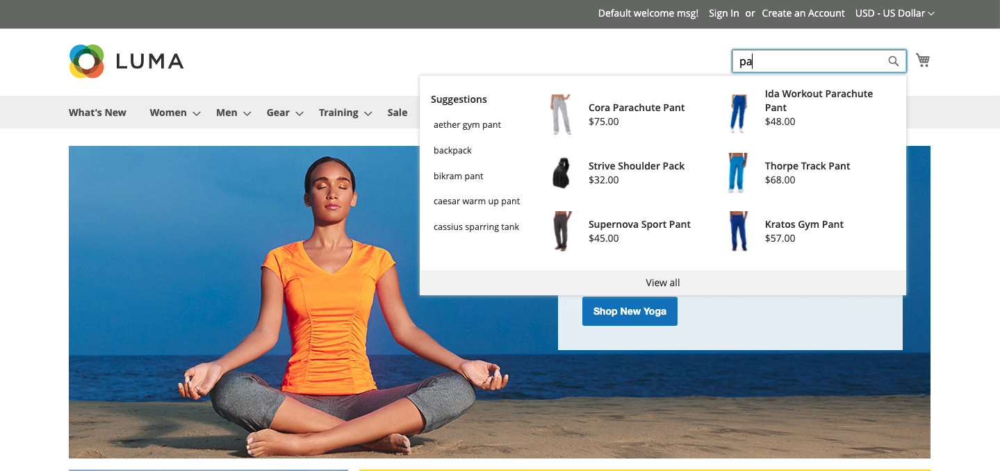

# Entrega de tienda

When [!DNL Live Search] es [instalado](install.md), aparece una ventana emergente en la tienda cuando los compradores escriben en la [Buscar](https://docs.magento.com/user-guide/catalog/search-quick.html) en la ventana Con cada carácter escrito, la ventana emergente se actualiza con productos sugeridos e imágenes en miniatura de los principales resultados de búsqueda.

[!DNL Live Search] devuelve los resultados de una consulta de dos caracteres o más. Para una coincidencia parcial, el número máximo de caracteres por palabra es de 20. El número de caracteres de una consulta &quot;buscar mientras escribe&quot; no se puede configurar.

>[!NOTE]
>
>La variable [!DNL Live Search] la ventana emergente de tienda solo está disponible para las tiendas que usan la variable *Luma* o un tema personalizado basado en *Luma*. La variable *Luma* se incluye en el [!DNL Commerce] datos de ejemplo. La ventana emergente no admite la variable *En blanco* tema. Consulte [Trabajo con un tema modificado](#working-with-modified-theme) para obtener más información.

## Atributos que se pueden buscar

Para obtener resultados con objetivos muy precisos, revise el conjunto de [buscable](https://docs.magento.com/user-guide/stores/attributes-product.html#storefront-properties) (`searchable=true`). Para garantizar la relevancia, haga que los atributos solo se puedan buscar si contienen contenido que tenga un significado claro y conciso. Evite utilizar atributos que contengan texto más largo y menos preciso, como `description`, que aunque la opción de búsqueda está activada de forma predeterminada, puede reducir la precisión de los resultados de búsqueda. Por ejemplo, si una persona busca &quot;pantalones cortos&quot; y hay camisas con una descripción que incluye el término &quot;mangas cortas&quot;, entonces las camisas se incluirán en los resultados de búsqueda.

Siempre se pueden buscar los atributos siguientes:

* `sku`
* `name`
* `categories`

