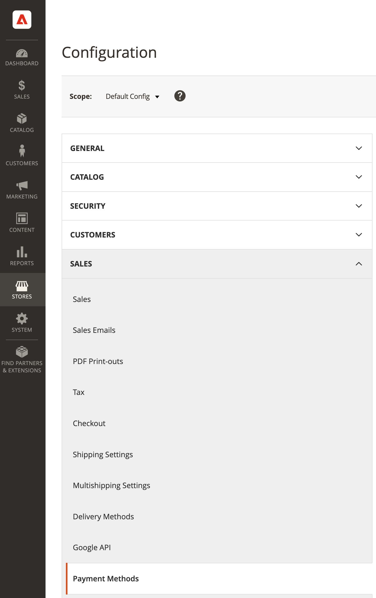

# Heredado [!DNL Payment Services] Configuración

Puede personalizar [!DNL Payment Services] satisfaga sus necesidades con opciones de configuración útiles en Admin.

Al configurar [!DNL Payment Services] para [!DNL Adobe Commerce] y [!DNL Magento Open Source] en el Administrador de, estas configuraciones se aplican únicamente al entorno configurado en la variable _[!UICONTROL Method]_campo de_[!UICONTROL General Configuration]_. Los cambios que realice en los campos de configuración son independientes del cambio del _[!UICONTROL Method]_selección (selection): si se cambia el método, las selecciones no se restablecen.

## Configuración general

Puede activar [!DNL Payment Services] para su tienda, y habilite la prueba de zona protegida o los pagos activos en la _[!UICONTROL General Configuration]_sección.

1. En el _Administrador_ barra lateral, vaya a **[!UICONTROL Stores]** > _[!UICONTROL Settings]_>**[!UICONTROL Configuration]**.
1. En el panel izquierdo, expanda **[!UICONTROL Sales]** y elija **[!UICONTROL Payment Methods]**.

   {width="400" zoomable="yes"}

1. Expanda el _[!UICONTROL Recommended Solutions]_sección.
1. En el _[!UICONTROL [!DNL Payment Services]]_, expanda la_[!UICONTROL General Configuration]_ sección.
1. Para **Activar**, configúrelo en `Yes` para habilitar [!DNL Payment Services] para su tienda.
1. Para **Método**, configúrelo en `Sandbox` si todavía está realizando la prueba [!DNL Payment Services] para su tienda o `Production` si está listo para habilitar los pagos activos.

   >[!WARNING]
   >
   >Su _[!UICONTROL Sandbox Merchant ID]_y_[!UICONTROL Production Merchant ID]_ se generan automáticamente y están presentes en sus campos respetables cuando haya terminado la incorporación para la zona protegida o la producción. No elimine ni cambie estos ID.

1. Para **Descriptor suave** (valores personalizados que se muestran en los extractos bancarios de las transacciones del cliente para delimitar entre tiendas/marcas/catálogos), agregue el texto personalizado (hasta 22 caracteres) en el campo de texto y reemplace `Custom descriptor` o el valor existente.
1. Clic **[!UICONTROL Save Config]** para guardar los cambios.
1. Vaya a **[!UICONTROL System]** > **[!UICONTROL Cache Management]** y haga clic en **[!UICONTROL Flush Cache]** para actualizar todas las cachés no válidas.

### Opciones de configuración

| Campo | Ámbito | Descripción |
|---|---|---|
| [!UICONTROL Enable] | sitio web | Habilitar o deshabilitar [!DNL Payment Services] para su sitio web. Opciones: `[!UICONTROL Yes]` / `[!UICONTROL No]` |
| [!UICONTROL Method] | vista de tienda | Defina el método o el entorno para su tienda. Opciones: [!UICONTROL Sandbox] / [!UICONTROL Production] |
| [!UICONTROL Sandbox Merchant ID] | vista de tienda | El ID de comerciante de la zona protegida, que se genera automáticamente durante la incorporación a la zona protegida. No cambie ni modifique este ID. |
| [!UICONTROL Production Merchant ID] | vista de tienda | Su ID de comerciante de producción, que se genera automáticamente durante la incorporación a la zona protegida. No cambie ni modifique este ID. |
| [!UICONTROL Soft Descriptor] | sitio web o vista de tienda | Añada un descriptor temporal a sus sitios web y vistas de tiendas para añadir información a las transacciones de clientes que delimitan marcas, tiendas o líneas de productos. |

## [!UICONTROL Credit Card Fields]

El [!UICONTROL Credit Card Fields] las opciones de pago ofrecen un proceso de pago simple y seguro para los métodos de pago con tarjeta de crédito o débito.

Consulte [Opciones de pago](payments-options.md#paypal-smart-buttons) para obtener más información.

1. En el _Administrador_ barra lateral, vaya a **[!UICONTROL Stores]** > _[!UICONTROL Settings]_>**[!UICONTROL Configuration]**.
1. En el panel izquierdo, expanda **[!UICONTROL Sales]** y elija **[!UICONTROL Payment Methods]**.
1. Expanda el _[!UICONTROL Recommended Solutions]_sección.
1. En el _[!UICONTROL Payment Services]_, expanda la_[!UICONTROL Credit Card Fields]_ sección.
1. Para **[!UICONTROL Title]**, introduzca el texto (si es necesario) para cambiar el nombre de la forma de pago como se muestra durante el cierre de compra.
1. Hasta [establecer la acción de pago](production.md#set-payment-services-as-payment-method), seleccione **[!UICONTROL Authorize]** o **Autorizar y capturar**.
1. Para priorizar una forma de pago en la página de pago, proporcione un `Numeric Only` valor en **[!UICONTROL Sort order]** field.
1. Para **[!UICONTROL Show on checkout page]**, elija `Yes` para habilitar los campos de tarjeta de crédito en la página de pago.
1. Para **[!UICONTROL Vault Enabled]**, elija `Yes` para habilitar el depósito de tarjetas de crédito para el cierre de compra.
1. Para **[!UICONTROL Vault Enabled in Admin]**, elija `Yes` para permitir al comerciante crear pedidos para clientes que utilizan su tarjeta de crédito abovedada.
1. Para habilitar **[!UICONTROL 3DS Secure authentication]** (`Off` de forma predeterminada) elija `Always` o `When required`.
1. Para **[!UICONTROL Debug Mode]**, elija `Yes` para activar el modo de depuración, o `No` para deshabilitarlo.
1. Clic **[!UICONTROL Save Config]** para guardar los cambios.
1. Vaya a **[!UICONTROL System]** > **[!UICONTROL Cache Management]** y haga clic en **[!UICONTROL Flush Cache]** para actualizar todas las cachés no válidas.

### Opciones de configuración

| Campo | Ámbito | Descripción |
|---|---|---|
| [!UICONTROL Title] | vista de tienda | Añada el texto que se mostrará como título para esta opción de pago en la vista Método de pago durante el cierre de compra. Opciones: [!UICONTROL text field] |
| [!UICONTROL Payment Action] | sitio web | El [acción de pago](https://experienceleague.adobe.com/docs/commerce-admin/config/sales/payment-methods/payment-methods.html) para el método de pago especificado. Opciones: [!UICONTROL Authorize] / [!UICONTROL Authorize and Capture] |
| [!UICONTROL Sort order] | vista de tienda | El orden de clasificación del método de pago especificado en la página de pago. `Numeric Only` valor |
| [!UICONTROL Show on checkout page] | sitio web | Habilite o deshabilite los campos de tarjeta de crédito en la página de cierre de compra. Opciones: [!UICONTROL Yes] / [!UICONTROL No] |
| [!UICONTROL Vault enabled] | vista de tienda | Habilitar o deshabilitar [depósito de tarjetas de crédito](vaulting.md). Opciones: [!UICONTROL Yes] / [!UICONTROL No] |
| [!UICONTROL Vault enabled in Admin] | vista de tienda | Habilitar o deshabilitar la capacidad para [para completar los pedidos de los clientes en Admin](vaulting.md) mediante un método de pago abovedado. Opciones: [!UICONTROL Yes] / [!UICONTROL No] |
| [!UICONTROL 3DS Secure authentication] | sitio web | Habilitar o deshabilitar [Autenticación segura en 3DS](security.md#3ds). Opciones: [!UICONTROL Always] / [!UICONTROL When Required] / [!UICONTROL Off] |
| [!UICONTROL Debug Mode] | sitio web | Habilite o deshabilite el modo de depuración. Opciones: `[!UICONTROL Yes]` / `[!UICONTROL No]` |

## [!UICONTROL Apple Pay]

El [!UICONTROL Apple Pay] La opción de pago permite al comerciante ofrecer Apple Pay a sus compradores, que pueden utilizar Touch ID en sus dispositivos para realizar compras

Consulte [Opciones de pago](payments-options.md#apple-pay-button) para obtener más información.

1. En el _Administrador_ barra lateral, vaya a **[!UICONTROL Stores]** > _[!UICONTROL Settings]_>**[!UICONTROL Configuration]**.
1. En el panel izquierdo, expanda **[!UICONTROL Sales]** y elija **[!UICONTROL Payment Methods]**.
1. Expanda el _[!UICONTROL Recommended Solutions]_sección.
1. En el _[!UICONTROL Payment Services]_, expanda la_[!UICONTROL Apple Pay]_ sección.
1. Para **[!UICONTROL Title]**, introduzca el texto (si es necesario) para cambiar el nombre de la forma de pago como se muestra durante el cierre de compra.
1. Hasta [establecer la acción de pago](production.md#set-payment-services-as-payment-method), seleccione **[!UICONTROL Authorize]** o **[!UICONTROL Authorize and Capture]**.
1. Para mostrar [!DNL Apple Pay] en la página cierre de compra, seleccione `Yes` para el **[!UICONTROL Show buttons on checkout page]**.
1. Para mostrar [!DNL Apple Pay] en la página de detalles del producto, seleccione `Yes` para el **[!UICONTROL Show buttons on product detail page]**.
1. Para mostrar [!DNL Apple Pay] en la vista previa del minicarrito, seleccione `Yes` para **[!UICONTROL Show buttons in mini cart preview]**.
1. Para mostrar [!DNL Apple Pay] en la página carro de compras, seleccione `Yes` para el **[!UICONTROL Show buttons on cart page]**.
1. Para activar el modo de depuración, seleccione `Yes` para el **[!UICONTROL Debug Mode]** (`No` lo desactiva).
1. Para guardar los cambios, haga clic en **[!UICONTROL Save Config]** .
1. Vaya a **[!UICONTROL System]** > **[!UICONTROL Cache Management]** y haga clic en **[!UICONTROL Flush Cache]** para actualizar todas las cachés no válidas.

### Opciones de configuración

| Campo | Ámbito | Descripción |
|---|---|---|
| [!UICONTROL Title] | vista de tienda | Añada el texto que se mostrará como título para esta opción de pago en la vista Método de pago durante el cierre de compra. Opciones: [!UICONTROL text field] |
| [!UICONTROL Payment Action] | sitio web | El [acción de pago](https://experienceleague.adobe.com/docs/commerce-admin/config/sales/payment-methods/payment-methods.html) para el método de pago especificado. Opciones: [!UICONTROL Authorize] / [!UICONTROL Authorize and Capture] |
| [!UICONTROL Show on checkout page] | sitio web | Habilitar o deshabilitar [!DNL Apple Pay] en la página de cierre de compra. Opciones: `[!UICONTROL Yes]` / `[!UICONTROL No]` |
| [!UICONTROL Show buttons on product detail page] | vista de tienda | Habilitar o deshabilitar [!DNL Apple Pay] en la página de detalles del producto. Opciones: `[!UICONTROL Yes]` / `[!UICONTROL No]` |
| [!UICONTROL Show buttons in mini-cart preview] | vista de tienda | Habilitar o deshabilitar [!DNL Apple Pay] en la vista previa del minicarrito. Opciones: `[!UICONTROL Yes]` / `[!UICONTROL No]` |
| [!UICONTROL Show buttons on cart page] | vista de tienda | Habilitar o deshabilitar [!DNL Apple Pay] en la página del carro de compras. Opciones: `[!UICONTROL Yes]` / `[!UICONTROL No]` |
| [!UICONTROL Debug Mode] | sitio web | Habilite o deshabilite el modo de depuración. Opciones: `[!UICONTROL Yes]` / `[!UICONTROL No]` |

## [!DNL PayPal Smart Buttons]

El [!DNL PayPal Smart Buttons] las opciones de pago ofrecen un proceso de pago simple, rápido y seguro para tu cliente.

Consulte [Opciones de pago](payments-options.md#paypal-smart-buttons) para obtener más información.

Configurar [!DNL PayPal Smart Buttons]

Puedes activar y configurar las opciones de pago de los botones inteligentes de PayPal en Admin:

1. En el _Administrador_ barra lateral, vaya a **[!UICONTROL Stores]** > _[!UICONTROL Settings]_>**[!UICONTROL Configuration]**.
1. En el panel izquierdo, expanda **[!UICONTROL Sales]** y elija **[!UICONTROL Payment Methods]**.
1. Expanda el _[!UICONTROL Recommended Solutions]_sección.
1. En el _[!UICONTROL Payment Services]_, expanda la_[!UICONTROL PayPal Smart Buttons]_ sección.
1. Para cambiar el nombre de la forma de pago como se muestra durante el pago, edite la _[!UICONTROL Title]_field.
1. Hasta [establecer la acción de pago](production.md#set-payment-services-as-payment-method), seleccione **[!UICONTROL Authorize]** o **[!UICONTROL Authorize and Capture]**.
1. Para priorizar una forma de pago en la página de pago, proporcione un `Numeric Only` valor en **[!UICONTROL Sort order]** field.
1. Para habilitar/deshabilitar la variable [Mensajería Pagar más tarde](payments-options.md#pay-later-button), seleccione `Yes`/`No` para **[!UICONTROL Display Pay Later Message]**.
1. Para mostrar los botones inteligentes de PayPal en la página de pago y envío, selecciona `Yes` para el **[!UICONTROL Show buttons on checkout page]**.
1. Para mostrar los botones inteligentes de PayPal en la página de detalles del producto, selecciona `Yes` para el **[!UICONTROL Show buttons on product detail page]**.
1. Para mostrar los botones inteligentes de PayPal en la vista previa del minicarrito, selecciona `Yes` para **[!UICONTROL Show buttons in mini cart preview]**.
1. Para mostrar los botones inteligentes de PayPal en la página del carro de compras, selecciona `Yes` para el **[!UICONTROL Show buttons on cart page]**.
1. Para habilitar Venmo como opción de pago, seleccione `Yes` para **[!UICONTROL Venmo Enabled]**.
1. Para activar las tarjetas de crédito y débito como opción de pago (botón PayPal Smart), selecciona `Yes` para **[!UICONTROL Credit and Debit Card Enabled]**.
1. Para habilitar/deshabilitar la variable [PayPal pagar más tarde](payments-options.md#pay-later-button) opción de pago, seleccione `Yes`/`No` para **[!UICONTROL PayPal Pay Later Enabled]**.
1. Para activar el modo de depuración, seleccione `Yes` para el **[!UICONTROL Debug Mode]** (`No` lo desactiva).
1. Para guardar los cambios, haga clic en **[!UICONTROL Save Config]** .
1. Vaya a **[!UICONTROL System]** > **[!UICONTROL Cache Management]** y haga clic en **[!UICONTROL Flush Cache]** para actualizar todas las cachés no válidas.

### Opciones de configuración

| Campo | Ámbito | Descripción |
|---|---|---|
| [!UICONTROL Title] | vista de tienda | Agrega el texto que se mostrará como título para esta opción de pago en la vista Método de pago durante el cierre de compra. Opciones: campo de texto |
| [!UICONTROL Payment Action] | sitio web | El [acción de pago](https://docs.magento.com/user-guide/configuration/sales/payment-methods.html#payment-actions){target="_blank"} para el método de pago especificado. Opciones: [!UICONTROL Authorize] / [!UICONTROL Authorize and Capture] |
| [!UICONTROL Display Pay Later Message] | sitio web | Habilite o deshabilite la mensajería Pagar más tarde en el carro de compras, la página del producto, el minicarrito y durante el flujo de cierre de compra. Opciones: `[!UICONTROL Yes]` / `[!UICONTROL No]` |
| [!UICONTROL Show buttons on checkout page] | vista de tienda | Habilitar o deshabilitar [!DNL PayPal Smart Buttons] en la página de cierre de compra. Opciones: `[!UICONTROL Yes]` / `[!UICONTROL No]` |
| [!UICONTROL Show buttons on product detail page] | vista de tienda | Habilitar o deshabilitar [!DNL PayPal Smart Buttons] en la página de detalles del producto. Opciones: `[!UICONTROL Yes]` / `[!UICONTROL No]` |
| [!UICONTROL Show buttons in mini-cart preview] | vista de tienda | Habilitar o deshabilitar [!DNL PayPal Smart Buttons] en la vista previa del minicarrito. Opciones: `[!UICONTROL Yes]` / `[!UICONTROL No]` |
| [!UICONTROL Show buttons on cart page] | vista de tienda | Habilitar o deshabilitar [!DNL PayPal Smart Buttons] en la página del carro de compras. Opciones: `[!UICONTROL Yes]` / `[!UICONTROL No]` |
| [!UICONTROL Venmo Enabled] | vista de tienda | Activa o desactiva la opción de pago Venmo donde se muestran los botones de pago. Opciones: `[!UICONTROL Yes]` / `[!UICONTROL No]` |
| [!UICONTROL Credit and Debit Card Enabled] | vista de tienda | Activa o desactiva las opciones de tarjeta de crédito y débito donde se muestran los botones de pago. Opciones: `[!UICONTROL Yes]` / `[!UICONTROL No]` |
| [!UICONTROL PayPal Pay Later Enabled] | vista de tienda | Activar o desactivar la opción de pago PayPal Más tarde en la que se muestran los botones de pago. Opciones: `[!UICONTROL Yes]` / `[!UICONTROL No]` |
| [!UICONTROL Debug Mode] | sitio web | Habilite o deshabilite el modo de depuración. Opciones: `[!UICONTROL Yes]` / `[!UICONTROL No]` |

## Estilo de botón

También puede configurar la variable _[!UICONTROL Button style]_opciones de los botones de pago:

1. En el _Administrador_ barra lateral, vaya a **[!UICONTROL Stores]** > _[!UICONTROL Settings]_>**[!UICONTROL Configuration]**.
1. En el panel izquierdo, expanda **[!UICONTROL Sales]** y elija **[!UICONTROL Payment Methods]**.
1. Expanda el _[!UICONTROL Recommended Solutions]_sección.
1. En el _[!UICONTROL [!DNL Payment Services]]_, expanda la_[!UICONTROL PayPal Smart Button Styling]_ sección.
1. Para definir el diseño, seleccione `Vertical` o `Horizontal` para **[!UICONTROL Layout]**
1. Para definir el color, seleccione entre los colores disponibles en **[!UICONTROL Color]**.
1. Para definir la forma, seleccione `Rectangular` o `Pill` para **[!UICONTROL Shape]**.
1. Para utilizar la altura por defecto, seleccione `Yes` o `No` para **[!UICONTROL Use Default Height]**.
1. Para definir la altura personalizada, añada la altura de píxel que desee para **[!UICONTROL Height]**.
1. Para definir el lema, seleccione `Yes` o `No` para **[!UICONTROL Tagline]**.
1. Para guardar los cambios, haga clic en **[!UICONTROL Save Config]** .
1. Vaya a **[!UICONTROL System]** > **[!UICONTROL Cache Management]** y haga clic en **[!UICONTROL Flush Cache]** para actualizar todas las cachés no válidas.

También puede configurar el estilo del botón de pago [en Configuración](settings.md#button-style) desde la página de inicio de Payment Services.

### Opciones de configuración

| Campo | Ámbito | Descripción |
|--- |--- |--- |
| [!UICONTROL Layout] | Vista de tienda | Define el estilo del diseño para los botones inteligentes de PayPal. Opciones: `[!UICONTROL Vertical]` / `[!UICONTROL Horizontal]` |
| [!UICONTROL Color] | Vista de tienda | Define el color de los botones inteligentes de PayPal. Opciones: [!UICONTROL Blue] / `[!UICONTROL Gold]` / `[!UICONTROL Silver]` / `[!UICONTROL White]` / `[!UICONTROL Black]` |
| [!UICONTROL Shape] | Vista de tienda | Define la forma de los botones inteligentes de PayPal. Opciones: `[!UICONTROL Rectangular]` / `[!UICONTROL Pill]` |
| [!UICONTROL Use Default Height] | Vista de tienda | Define si los botones inteligentes de PayPal utilizan una altura predeterminada. Opciones: `[!UICONTROL Yes]` / `[!UICONTROL No]` |
| [!UICONTROL Height] | Vista de tienda | Definir la altura de los botones inteligentes de PayPal. Valor predeterminado: ninguno |
| [!UICONTROL Label] | Vista de tienda | Definir la etiqueta que aparece en los botones inteligentes de PayPal. Opciones: `[!UICONTROL PayPal]` / `[!UICONTROL Checkout]` / `[!UICONTROL Buynow]` / `[!UICONTROL Pay]` / `[!UICONTROL Installment]` |
| [!UICONTROL Tagline] | Vista de tienda | Habilita el lema. Opciones: `[!UICONTROL Yes]` / `[!UICONTROL No]` |

## Vaciar la caché

Si cambia la configuración, [vaciar manualmente la caché](/help/payment-services/settings.md#flush-the-cache) para que la tienda muestre los ajustes de configuración más recientes.
