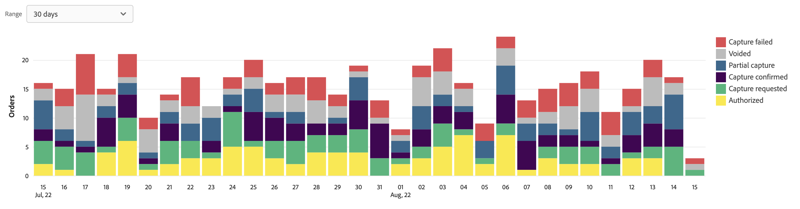

# Informe Estado de Pago del Pedido

[!DNL Payment Services] para [!DNL Adobe Commerce] y [!DNL Magento Open Source] le ofrece informes completos para que pueda obtener una visión clara de los pedidos y pagos de su tienda.

Existen dos vistas de informes de estado de pagos de pedidos disponibles para que pueda consultar rápidamente el estado de pago de sus pedidos:

* **[Vista de visualización del estado de pago del pedido](#order-payment-status-data-visualization-view)**: gráfico disponible en la página de inicio de Payment Services que es una representación visual de los estados de pago agregados por día desde la vista de informe Estado de pago del pedido
* **[Vista del informe de estado del pago del pedido](#order-payment-status-report-view)**: informe disponible en el estado de pago del pedido que muestra los estados detallados de pago, facturado, enviado, reembolso y disputa de todas las transacciones

Las vistas de estado de pago de pedido le ayudan a comprender fácilmente dónde se encuentra un pedido específico dentro del flujo de proceso de pago en efectivo. Estos informes le permiten ver rápidamente los pedidos (según su estado de pago y fecha de pago) e identificar cualquier problema potencial.

Puede descargar transacciones de estado de pago de pedidos en formato de archivo .csv para usarlas en software de contabilidad o gestión de pedidos existente.

>[!NOTE]
>
>No puede ver informes financieros si no lo ha hecho [Modo en directo incorporado y activado](production.md#enable-live-payments) para [!DNL Payment Services].

## Vista de visualización de datos del estado de pago del pedido

La vista de visualización de datos del estado de pago del pedido está disponible en la página de inicio de Payment Services. Es una representación visual de los estados de pago agregados por día del cuadro detallado [Vista del informe de estado del pago del pedido](#order-payment-status-report-view).

En el _Administrador_ barra lateral, vaya a **Ventas** > **Servicios de pago** para ver la visualización de datos [estado del plan de pagos](#statuses-information).

{zoomable=yes}

Clic **Ver informe** para ir a la tabla detallada [Vista del informe de estado del pago del pedido](#order-payment-status-report-view).

### Personalizar intervalo de tiempo de estados

De forma predeterminada, se muestran los 30 días de estados de pago.

Desde la vista de visualización Estado de pago del pedido, puede personalizar el periodo de tiempo para los estados de pago que desea consultar seleccionando un intervalo de fechas:

1. En el _Administrador_ barra lateral, vaya a **[!UICONTROL Sales]** > **[!UICONTROL Payment Services]**. La vista de visualización de datos del estado de pago del pedido se puede ver en la sección Estado de pago del pedido.
1. Haga clic en **[!UICONTROL Range]** filtro selector.
1. Elija el intervalo de fechas aplicable: 30 días, 15 días o 7 días.
1. Ver la información de estado de las fechas especificadas.

### Información de estados

Los estados de pago de un intervalo de fechas seleccionado se muestran a la izquierda de la vista de visualización de datos Estado de pago del pedido. Las fechas del intervalo de fechas seleccionado se muestran en la parte inferior de la vista. Si no ha habido pedidos en una fecha determinada, esa fecha no aparece.

La vista de visualización de datos de estado de pago del pedido incluye la siguiente información.

| Datos | Descripción |
| ------------ | -------------------- |
| [!UICONTROL Orders] | Intervalo de importes para pedidos en un período de tiempo especificado; datos en el eje Y (izquierda) |
| Intervalo de fechas | Intervalo de fechas para el lapso de tiempo especificado; datos en el eje X (inferior) |
| Autorizado | Pedido autorizado |
| Captura solicitada | Captura solicitada para pedido |
| Captura confirmada | Captura de pedidos completada |
| Captura parcial | Pedido capturado parcialmente |
| Error de captura | Error de captura de pedido |
| Anulado | Pedido anulado |

## Vista del informe de estado del pago del pedido

La vista Informe de estado de pago del pedido está disponible en la vista Estado de pago del pedido de Servicios de pago. Incluye estados detallados (pago, facturado, enviado, reembolso, disputa y más) de todas las transacciones. El [Vista de visualización de datos del estado de pago del pedido](#order-payment-status-data-visualization-view) en Página de inicio de Servicios de pago es una representación visual de los estados de pago agregados por día desde la vista Informe de estado de pago del pedido.

En el _Administrador_ barra lateral, vaya a **[!UICONTROL Sales]** > **[!UICONTROL Payment Services]** > **[!UICONTROL Order payment status]** para ver la tabla detallada de la vista de informe Estado de los pagos de pedidos.

Puede configurar esta vista, según las secciones de este tema, para presentar mejor los datos que desee ver.

Puede [descargar transacciones de pago](#download-order-payment-statuses) en formato de archivo .csv para su uso en software de contabilidad o gestión de pedidos existente.

>[!NOTE]
>
>Los datos mostrados en esta tabla se ordenan en orden descendente (`DESC`) de forma predeterminada, con `TRANS DATE`. El `TRANS DATE` es la fecha y hora en que se inició la transacción.

### Datos utilizados en el informe

El [!DNL Payment Services] Este módulo utiliza datos de pedidos y los combina con datos de pagos agregados de otras fuentes (incluido PayPal) para ofrecer informes significativos y muy útiles.

Los datos de pedidos se exportan y se mantienen en el servicio de pago. Cuando usted [cambiar o agregar estados de pedidos](https://docs.magento.com/user-guide/sales/order-status-custom.html){target="_blank"} or [edit a store view](https://docs.magento.com/user-guide/stores/stores-all-view-edit.html){target="_blank"}, [store](https://docs.magento.com/user-guide/stores/store-information.html){target="_blank"}, o nombre del sitio web, esos datos se combinan con los datos de pago y el informe de estado de pago del pedido se rellena con la información combinada.

Este proceso consta de dos pasos:

1. El índice se cambia por datos `ON SAVE` (cada vez que se cambia la información de pedido o de tienda) o `BY SCHEDULE` (en una programación cron preconfigurada), según cómo se configure en [Administración de índices](https://docs.magento.com/user-guide/system/index-management.html){target="_blank"} en el Administrador.

   De forma predeterminada, se produce la indexación de datos `ON SAVE`, lo que significa que cada vez que algo cambia en el orden, el estado del pedido, la vista del almacén, el almacén o el sitio web, el proceso de reindexación se produce inmediatamente.

1. Los datos indexados se envían al servicio de pago, que a continuación se rellena en el informe de estado de pago del pedido.

Los únicos datos que se exportan y recopilan con fines informativos son los datos utilizados por el informe de estado del pago del pedido.

>[!NOTE]
>
>Los datos mostrados en esta tabla se ordenan en orden descendente (`DESC`) de forma predeterminada, con `ORDER DATE`. El `ORDER DATE` es la marca de fecha y hora en la que se creó el pedido.

#### Configuración de exportación de datos

Aunque, de forma predeterminada, la reindexación se produce en `ON SAVE` modo, se recomienda indexar en `BY SCHEDULE` modo. El `BY SCHEDULE` El índice se ejecuta en una programación cron de un minuto y los datos modificados aparecen en el informe de estado del pedido en un plazo de dos minutos tras cualquier cambio de datos. Esta reindexación programada le ayuda a reducir cualquier tensión en su tienda, especialmente si tiene un gran volumen de pedidos entrantes, ya que se produce en una programación (no como cada pedido se realiza).

Puede cambiar el modo de índice:`ON SAVE` o `BY SCHEDULE`—[en la Admin](https://docs.magento.com/user-guide/system/index-management.html#change-the-index-mode){target="_blank"}.

Para obtener información sobre cómo configurar la exportación de datos, consulte [Configuración de la línea de comandos](configure-cli.md#configure-data-export).

### Seleccionar fuente de datos

En la vista Informe de estado de pago del pedido, puede seleccionar el origen de datos—_[!UICONTROL Live]_o_[!UICONTROL Sandbox]_: para el que se desea ver los resultados del informe.

{width=400px}

If _[!UICONTROL Live]_es la fuente de datos seleccionada, puede ver información de informes de las tiendas que utilizan [!DNL Payment Services] en modo de producción. If_[!UICONTROL Sandbox]_ es la fuente de datos seleccionada, puede ver la información del informe del modo de zona protegida.

Las selecciones de fuentes de datos funcionan de la siguiente manera:

* Si no tiene ninguna tienda que utilice [!DNL Payment Services] en el modo Activo, la selección de la fuente de datos toma el valor predeterminado _[!UICONTROL Sandbox]_.
* Si tiene tiendas (una o varias) que utilicen [!DNL Payment Services] en el modo Activo, la selección de la fuente de datos toma el valor predeterminado _[!UICONTROL Live]_.
* Las exportaciones de informes siempre respetan la selección de fuente de datos.

Para seleccionar la fuente de datos de su [!UICONTROL Order Payment Status] informe:

1. En el _Administrador_ barra lateral, vaya a **[!UICONTROL Sales]** > **[!UICONTROL [!DNL Payment Services]]** > **[!UICONTROL Order payment status]**.
1. Clic **[!UICONTROL Data source]** y seleccione _[!UICONTROL Live]_o_[!UICONTROL Sandbox]_.

   Los resultados del informe se regeneran en función del origen de datos seleccionado.

### Personalizar fechas/periodo

Desde la vista Informe de estado de pago del pedido, puede personalizar el periodo de tiempo de los estados que desea consultar seleccionando fechas específicas. De forma predeterminada, se muestran en la cuadrícula 30 días de estados de pago del pedido.

1. En el _Administrador_ barra lateral, vaya a **[!UICONTROL Sales]** > **[!UICONTROL [!DNL Payment Services]]** > **[!UICONTROL Order payment status]**.
1. Haga clic en **[!UICONTROL Order dates]** filtro selector de calendario.
1. Seleccione el intervalo de fechas aplicable.
1. Permite ver los estados de pago de los pedidos para las fechas especificadas en la cuadrícula.

### Mostrar y ocultar columnas

El informe Estado de Pago del Pedido muestra todas las columnas de información disponibles de forma predeterminada. Sin embargo, puede personalizar qué columnas ve en el informe.

1. En el _Administrador_ barra lateral, vaya a **[!UICONTROL Sales]** > **[!UICONTROL [!DNL Payment Services]]** > **[!UICONTROL Order payment status]**.
1. Haga clic en _Configuración de columna_ icono ().
1. Para personalizar qué columnas ve en el informe, marque o desmarque columnas en la lista.

   El informe Estado de pago del pedido mostrará inmediatamente los cambios realizados en el menú Configuración de columna. Las preferencias de columna se guardarán y permanecerán en vigor si se aleja de la vista Informes.

### Ver estados

La vista de informe Estado de Pago del Pedido muestra información completa sobre el estado de la transacción y el estado de pago de cada pedido de Payment Services.

#### Estado de transacción

De forma predeterminada, se muestran en la cuadrícula 30 días de estados de pago del pedido.

Desplácese a la izquierda y a la derecha para ver [información de estado de pago del pedido](#column-descriptions), incluida la fecha de pedido, la fecha de autorización, la facturación, el envío, el estado de pago, etc.

El número de filas devueltas en una búsqueda, o que se muestran en los 30 días predeterminados de estados de pago del pedido, se muestra encima de la cuadrícula de vista de estado de pago del pedido junto con el filtro de selector de calendario de fechas del pedido.

#### Estado de pago

La columna Estado de pago muestra el estado actual de cualquier pago. A `Capture failed` el pago muestra un estado de alerta rojo y una `Voided` el pago muestra un estado de alerta gris.

#### Estado del reembolso

La columna Estado de reembolso muestra el estado actual de cualquier reembolso. A `Capture failed` el pago muestra un estado de alerta rojo y una `Voided` el pago muestra un estado de alerta gris.

### Actualización de datos del informe

La vista del informe Estado de los pagos del pedido muestra un _[!UICONTROL Last updated]_marca de tiempo que muestra la última vez que se actualizó la información del informe. De forma predeterminada, los datos del informe Estado de los pagos de los pedidos se actualizan automáticamente cada tres horas.

También puede forzar manualmente la actualización de los datos del informe de estado de los pagos de pedidos para ver la información del informe más actualizada.

1. En el _Administrador_ barra lateral, vaya a **[!UICONTROL Sales]** > **[!UICONTROL [!DNL Payment Services]]** > **[!UICONTROL Order payment status]**.
1. Haga clic en _Actualizar_ icono ().

   Se actualizan los datos del informe de estado de pago del pedido, y *[!UICONTROL Update complete]* aparece una confirmación y la información más reciente está presente en la cuadrícula.

### Ver disputas

Puedes ver cualquier disputa sobre los pedidos de tu tienda y navegar hasta el Centro de resolución de PayPal para tomar medidas al respecto, desde el informe de estado de pago del pedido.

1. En el _Administrador_ barra lateral, vaya a **[!UICONTROL Sales]** > **[!UICONTROL [!DNL Payment Services]]** > **[!UICONTROL Order payment status]**.
1. Vaya a **[!UICONTROL Disputes column]**.
1. Vea las disputas de un pedido específico y consulte [el estado de la disputa](#order-payment-status-information).
1. Haga clic en el vínculo de ID de disputa (que comienza con _PP-D-_) para ir a [Centro de resolución de PayPal](https://www.paypal.com/us/smarthelp/article/what-is-the-resolution-center-faq3327).
1. Tome las medidas apropiadas para la disputa, según sea necesario.

   Para ordenar las disputas por estado, haga clic en el encabezado de la columna Disputas.

### Descargar estados de pago de pedidos

Puede descargar un archivo .csv con todos los estados visibles en la cuadrícula de la vista Estado de los pagos de pedidos, tanto si visualiza los 30 días de estados predeterminados como si utiliza un periodo de tiempo personalizado.

1. En el _Administrador_ barra lateral, vaya a **[!UICONTROL Sales]** > **[!UICONTROL [!DNL Payment Services]]** > **[!UICONTROL Order payment status]**.
1. Si desea ver los estados de un periodo de tiempo distinto de los últimos 30 días, [personalizar el intervalo de tiempo para los estados](#customize-dates-timeframe).
1. Haga clic en _Descargar_ () icono.

Los estados de pago del pedido se descargan en formato .csv.

<!-- ## Default order payment status timeframes

These order payment status timeframes are currently available in [!DNL Payment Services].

| Report       | Description          |
| ------------ | -------------------- |
| Yesterday | Available from the Order payment status dates selector, this shows information for the prior date. |
| | Today | Available from the Order payment status dates selector, this shows information for the current day. |
| Last 7 days | Available from the Order payment status dates selector, this shows information for the last seven days. |
| Last 30 days | Available from the Order payment status dates selector and by default in the Order payment statuses view, this shows information for the last 30 days. |
| Last 90 days | Available from the Order payment status dates selector, this shows information for the last 90 days. |
| Year to date | Available from the Order payment status dates selector, this shows information for the the entire year to date. |
| Custom range | Available from the Order payment status dates selector, this can be filtered to show a custom date range. |
-->

#### Información de estados

Los informes de estado de pago del pedido incluyen la siguiente información.

| Columna | Descripción |
| ------------ | -------------------- |
| [!UICONTROL Order ID] | ID de pedido de comercio   Para ver información relacionada [información del pedido](https://docs.magento.com/user-guide/sales/orders.html){target="_blank"}, haga clic en el ID. |
| [!UICONTROL Order Date] | Marca de fecha y hora del pedido |
| [!UICONTROL Authorized Date] | Fecha y hora de la autorización de pago |
| [!UICONTROL Order Status] | Comercio actual [estado del pedido](https://docs.magento.com/user-guide/sales/order-status.html){target="_blank"} |
| [!UICONTROL Invoiced] | Estado de factura del pedido—*[!UICONTROL No]*, *[!UICONTROL Partial]*, o *[!UICONTROL Yes]* |
| [!UICONTROL Shipped] | Estado de envío del pedido—*[!UICONTROL No]*, *[!UICONTROL Partial]*, o *[!UICONTROL Yes]* |
| [!UICONTROL Order Amt] | Importe total general del pedido |
| [!UICONTROL Cur] | Tipo de divisa del pedido |
| [!UICONTROL Pay Status] | Estado del pago de un pedido específico |
| [!UICONTROL Paid Amt] | Importe pagado en un pedido |
| [!UICONTROL Cur] | Tipo de divisa del importe pagado de un pedido |
| [!UICONTROL Refund Status] | Estado de un reembolso de un pedido (por ejemplo, información de devoluciones, autorizaciones de devolución de material y notas de abono)—   *[!UICONTROL Requires refund]*, *[!UICONTROL Refund requested]*, *[!UICONTROL Refunded]*, *[!UICONTROL Refund failed]*, o *[!UICONTROL Voided]* |
| [!UICONTROL Refund Amount] | Total del importe reembolsado de un pedido |
| [!UICONTROL Cur] | Tipo de divisa del importe reembolsado de un pedido |
| [!UICONTROL Disputes] | Estado de cualquier disputa sobre un pedido (información de disputas y devoluciones de cargos)—*[!UICONTROL Open]*, *[!UICONTROL Waiting for buyer response]*, *[!UICONTROL Waiting for seller response]*, *[!UICONTROL Under review]*, *[!UICONTROL Resolved]*, o *[!UICONTROL Other]* |
| [!UICONTROL Payment Method] | Método de pago utilizado en la transacción comercial de un pedido |
| [!UICONTROL Website] | Sitio web desde el que se realizó el pedido |
| [!UICONTROL Store] | Almacén desde el que se realizó el pedido |
| [!UICONTROL Store View] | Vista de tienda desde la que se realizó el pedido |
