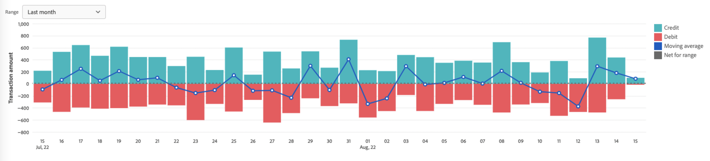

# Informe de rutas

[!DNL Payment Services] para [!DNL Adobe Commerce] y [!DNL Magento Open Source] ofrece informes completos para que pueda obtener una visión clara de los pedidos y pagos de su tienda.

Hay dos vistas de informes de pago disponibles para que pueda ver información detallada sobre todos sus pagos:

* **[Vista de visualización de datos de rutas](#payouts-data-visualization-view)**—Gráfico disponible en la página de inicio de servicios de pago que es una representación visual de importes agregados por día desde la vista de informes de pagos
* **[Vista de informes de rutas](#payouts-report-view)**: informe disponible en Pagos que muestra información detallada sobre el pago de todas las transacciones

Las vistas Pagos muestran información completa de pago de un vistazo, lo que le permite una total transparencia en el importe del pago, el volumen procesado y los informes detallados sobre el nivel de transacción para la reconciliación financiera.

>[!NOTE]
>
>Los informes de pagos solo muestran los pedidos que se capturan (la acción de pago se establece en [`Authorize and Capture`](https://experienceleague.adobe.com/docs/commerce-merchant-services/payment-services/get-started/production.html#set-payment-services-as-payment-method)), o [marcado como `Invoiced`](https://docs.magento.com/user-guide/sales/invoice-create.html).

## Vista de visualización de datos de rutas

La vista Visualización de datos de pagos está disponible en la página principal de servicios de pago. Es una representación visual de las cantidades agregadas por día a partir de la tabla detallada. [Vista de informes de rutas](#payouts-report-view).

En el _Administrador_ barra lateral, vaya a **[!UICONTROL Sales]** > **[!UICONTROL Payment Services]** para ver el gráfico de visualización de datos de créditos frente a débitos y los promedios móviles a lo largo del tiempo.

Haga clic en **[!UICONTROL View Report]** para desplazarse a la tabla detallada [Vista de informes de rutas](#payouts-report-view).

### Personalización del intervalo de tiempo de las transacciones

De forma predeterminada, se muestran 30 días de transacciones.

Desde la vista Visualización de datos de pago , puede personalizar el intervalo de tiempo para las transacciones de pago que desee ver seleccionando un intervalo de fechas:

1. En el _Administrador_ barra lateral, vaya a **[!UICONTROL Sales]** > **[!UICONTROL Payment Services]**. La vista Visualización de datos de rutas se puede ver en la sección Pagarés .
1. Haga clic en el **[!UICONTROL Range]** filtro de selector.
1. Elija el intervalo de fechas aplicable: 30 días, 15 días o 7 días.
1. Ver la información de transacciones de las fechas especificadas.

### Información de transacciones

Las cantidades de transacción para un intervalo de fechas seleccionado se muestran a la izquierda de la vista Visualización de datos de pagos . Las fechas del intervalo de fechas seleccionado se muestran en la parte inferior de la vista. Si no hubo pagos en una fecha en particular, esa fecha no aparecerá.

La vista Visualización de datos de rutas incluye la siguiente información.

| Datos | Descripción |
| ------------ | -------------------- |
| [!UICONTROL Transaction amount] | Rango de cantidades para las transacciones en un plazo determinado; datos en el eje Y (izquierda) |
| Intervalo de fechas | Intervalo de fechas para el lapso de tiempo especificado; datos en el eje X (inferior) |
| Crédito | Pagos en el plazo especificado |
| Depósito | Deudas (reembolsos) correspondientes al plazo especificado |
| Media móvil | Representación del pago promedio para cada fecha en el lapso de tiempo especificado |
| Neto para rango | Cantidad neta de pago para el lapso de tiempo especificado (intervalo) |

## Vista de informes de rutas

La vista de informe de pagos está disponible en la vista de pagos de los servicios de pago. Incluye toda la información disponible sobre los pagos de sus tiendas. La variable [Vista de visualización de datos de rutas](#payouts-data-visualization-view) en la página de inicio de servicios de pago es una representación visual de los importes agregados por día en esta vista de informe más detallada.

En el _Administrador_ barra lateral, vaya a **[!UICONTROL Sales]** > **[!UICONTROL Payment Services]** > **[!UICONTROL Payouts]** para ver la vista detallada del informe de pagos tabulares.

Puede configurar esta vista, según las secciones de este tema, para presentar mejor los datos que desee ver.

Consulte ID de transacción y pedidos de comercio vinculados, importes de transacción, método de pago por transacción y mucho más, todo dentro del informe Pagos en el Administrador.

Puede descargar transacciones de pago en formato de archivo .csv para utilizarlo en software de gestión de pedidos o cuentas existentes.

>[!NOTE]
>
>Los datos mostrados en esta tabla se ordenan en orden descendente (`DESC`) de forma predeterminada, con la variable `TRANS DATE`. La variable `TRANS DATE` es la fecha y hora en que se inició la transacción.

### Seleccionar fuente de datos

En la vista de informe de pagos, puede seleccionar la fuente de datos:_[!UICONTROL Live]_o_[!UICONTROL Sandbox]_: para el cual desea ver los resultados del informe.

If _[!UICONTROL Live]_es la fuente de datos seleccionada; puede ver la información de informes de las tiendas activas. If [!UICONTROL Sandbox]_ es la fuente de datos seleccionada; puede ver la información del informe para su entorno de espacio aislado.

Las selecciones de fuentes de datos funcionan de la siguiente manera:

* Si no tiene ninguna tienda en el modo Activo, la selección de la fuente de datos toma como valor predeterminado _[!UICONTROL Sandbox]_.
* Si tiene alguna tienda (una o varias) en el modo Activo, la selección de la fuente de datos toma el valor predeterminado _[!UICONTROL Live]_.
* Las exportaciones de informes siempre respetan la selección del origen de datos.

Para seleccionar la fuente de datos para el informe Estado de pago de pedido:

1. En el _Administrador_ barra lateral, vaya a **[!UICONTROL Sales]** > **[!UICONTROL Payment Services]** > **[!UICONTROL Payouts]**.
1. Haga clic en **[!UICONTROL Data source]** y seleccione _[!UICONTROL Live]_o_[!UICONTROL Sandbox]_.

   Los resultados del informe se regeneran según la fuente de datos seleccionada.

### Ver transacciones

De forma predeterminada, se muestran 30 días de transacciones.

El número de filas devueltas en una búsqueda, o mostradas en los 30 días de transacciones predeterminados, se muestra encima de la cuadrícula de vista Pagos junto al filtro Selector de calendario Fechas de transacción .

Desplácese a la izquierda y a la derecha para ver [información para cada transacción de pago](#column-descriptions) en el informe diario, incluidos la fecha de transacción, el ID de referencia, el número de factura y los detalles de método de pago.

#### Personalización del intervalo de tiempo de las transacciones

Desde la vista Informe de pagos, puede personalizar el intervalo de tiempo para las transacciones de pago que desee ver introduciendo fechas específicas o seleccionando un intervalo de fechas del selector de fechas:

1. En el _Administrador_ barra lateral, vaya a **[!UICONTROL Sales]** > **[!UICONTROL Payment Services]** > **[!UICONTROL Payouts]**.
1. Haga clic en el filtro Selector de calendario de fechas de transacción .
1. Elija el intervalo de fechas aplicable.
1. Vea los estados de las ganancias en la cuadrícula para las fechas especificadas.

### Mostrar y ocultar columnas

La vista de informe de pagos muestra la mayoría de las columnas de información disponibles de forma predeterminada. Sin embargo, puede personalizar qué columnas ve en el informe.

1. En el _Administrador_ barra lateral, vaya a **[!UICONTROL Sales]** > **[!UICONTROL [!DNL Payment Services]]** > **[!UICONTROL Payouts]**.
1. Haga clic en el _Configuración de columna_ icono ().
1. Para personalizar qué columnas ve en el informe, marque o desmarque las columnas de la lista.

   La vista de informe de pagos mostrará inmediatamente los cambios realizados en el menú de configuración de columna. Las preferencias de columna se guardarán y permanecerán en vigor si se sale de la vista del informe.

### Descargar transacciones

Puede descargar un archivo .csv que contenga todas las transacciones visibles en la cuadrícula de vista de pagos.

1. En el _Administrador_ barra lateral, vaya a **[!UICONTROL Sales]** > **[!UICONTROL Payment Services]** > **[!UICONTROL Payouts]**.
1. [Personalización del intervalo de fechas para las transacciones](#customize-transactions-timeframe).
1. Haga clic en el _Descargar_ ().

Las transacciones de pago se descargan en formato .csv .

### Descripciones de columnas

Los informes de pago incluyen la siguiente información.

| Columna | Descripción |
| ------------ | -------------------- |
| [!UICONTROL Provider] | Proveedor de pago |
| [!UICONTROL Provider trans] | ID de transacción |
| [!UICONTROL Trans date] | Fecha y hora en que se inició la transacción |
| [!UICONTROL Type] | Tipo de transacción—*[!UICONTROL PAYMENT]*, *[!UICONTROL BONUS]*, *[!UICONTROL CHARGEBACK]*, *[!UICONTROL CORRECTION]*, *[!UICONTROL CURRENCY_CONVERSATION]*, *[!UICONTROL DEPOSIT]*, *[!UICONTROL DISBURSEMENT]*, *[!UICONTROL DISPUTE]*, *[!UICONTROL FEES]*, *[!UICONTROL HOLD]*, *[!UICONTROL HOLD_RELEASE]*, *[!UICONTROL INCENTIVES]*, *[!UICONTROL OTHERS]*, *[!UICONTROL RECOUP]*, *[!UICONTROL REFUND]*, *[!UICONTROL REVERSAL]*, *[!UICONTROL WITHDRAWAL]*    Consulte [Tipos de transacciones](#transaction-types) para obtener más información. |
| [!UICONTROL Status] | Estado actual de la operación—*[!UICONTROL SUCCESS]*, *[!UICONTROL DENIED]*, *[!UICONTROL PENDING]* |
| [!UICONTROL Code] | Código de transacción que indica Crédito (*CR*) o débito (*DR*) |
| [!UICONTROL Reference ID] | ID de transacción original para el que este evento está relacionado |
| [!UICONTROL Invoice] | ID de factura (uno por pedido) de la transacción |
| [!UICONTROL Commerce order] | ID de pedido de comercio    Para ver [información del pedido](https://docs.magento.com/user-guide/sales/orders.html){target=&quot;_blank&quot;}, haga clic en el ID. |
| [!UICONTROL Commerce trans] | ID de transacción de comercio    Para ver [información de transacción](https://docs.magento.com/user-guide/sales/transactions.html){target=&quot;_blank&quot;}, haga clic en el ID. |
| [!UICONTROL Pay method] | Tipo de tarjeta de crédito—*[!UICONTROL BANK]*, *[!UICONTROL PAYPAL]*, *[!UICONTROL APPLE_PAY]*, *[!UICONTROL CREDIT_CARD]*—y el proveedor de tarjetas asociado (por ejemplo, *Visa* o *MasterCard*) |
| [!UICONTROL Trans amt] | Importe de la transacción |
| [!UICONTROL Cur] | Unidad de divisa para el importe de transacción |
| [!UICONTROL Pending] | Cantidad pendiente de desembolso |
| [!UICONTROL Cur] | Unidad de divisa para el importe pendiente |
| [!UICONTROL Seller amt] | Importe de los fondos transferidos a un cliente o de éste    Los fondos que salen de la cuenta de vendedor muestran un prefijo de guión (-). |
| [!UICONTROL Cur] | Unidad de divisa del importe del vendedor |
| [!UICONTROL Partner fee] | Tarifas de socio asociadas con la transacción    Los fondos que se mueven fuera de la cuenta de tarifa de socio muestran un prefijo (-) de guión. |
| [!UICONTROL Cur] | Unidad de divisa para la tarifa del socio |
| [!UICONTROL Prov fees] | Tarifas asociadas con la transacción    Los fondos que se mueven fuera de la cuenta de tarifa del proveedor muestran un prefijo de guión (-). |
| [!UICONTROL Cur] | Unidad de divisa para la tarifa del proveedor |
| [!UICONTROL Fee %] | Porcentaje del importe de la transacción cobrado como comisión |
| [!UICONTROL Fixed fee] | Cantidad fija de cuota de proveedor |
| [!UICONTROL Chbk fee] | Tarifa de recarga asociada con la transacción    El prefijo de guión (-) indica que se ha invertido la tarifa de devolución de gastos. |
| [!UICONTROL Cur] | Unidad de divisa para la tasa de recarga |
| [!UICONTROL Hold amt] | Cantidad retenida o liberada de la suspensión    El prefijo de guión (-) indica que se liberan fondos en espera. |
| [!UICONTROL Cur] | Unidad de divisa para el importe de retención |
| [!UICONTROL Recoup amt] | Importe recuperado de la cuenta de recuperación    Los fondos que se mueven fuera de la cuenta de recuperación muestran un prefijo de guión (-). |
| [!UICONTROL Cur] | Unidad de divisa para el importe recuperado |

### Tipos de transacciones

Estos tipos de transacciones pueden anotarse en las transacciones de pago.

| Informe | Descripción |
| ------------ | -------------------- |
| [!UICONTROL PAYMENT] | Dinero movido entre un comprador y un vendedor para un pedido |
| [!UICONTROL AUTH] | Autorización y autorización anulan transacciones |
| [!UICONTROL BONUS] | — |
| [!UICONTROL CHARGEBACK] | Transacciones de reversión de comisiones y comisiones de recarga |
| [!UICONTROL CORRECTION] | — |
| [!UICONTROL CURRENCY_CONVERSION] | — |
| [!UICONTROL DEPOSIT] | — |
| [!UICONTROL DISBURSEMENT] | — |
| [!UICONTROL DISPUTE] | — |
| [!UICONTROL FEES] | Tarifas de socio, comisiones de pago y transacciones de inversión de comisiones |
| [!UICONTROL HOLD] | — |
| [!UICONTROL HOLD_RELEASE] | — |
| [!UICONTROL INCENTIVES] | — |
| [!UICONTROL OTHERS] | — |
| [!UICONTROL RECOUP] | Recuperaciones de cuentas bancarias o de pérdidas |
| [!UICONTROL REFUND] | — |
| [!UICONTROL REVERSAL] | — |
| [!UICONTROL WITHDRAWAL] | — |
