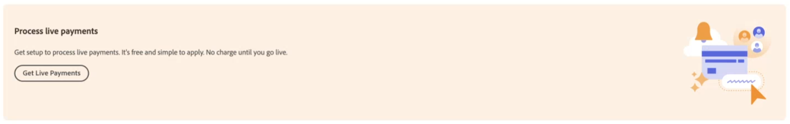

# Activar [!DNL Payment Services] para producción

Puede poner el servicio en producción y completar la [proceso de incorporación](onboard.md), para seguir los pasos de este tema, después de hacer lo siguiente:

* [Instalar](install.md) la extensión Servicios de pago
* [Configuración y conexión](connect.md) su instancia
* [Configuración de](sandbox.md) y [prueba](test-validate.md) su zona protegida

## Establecer [!DNL Payment Services] como forma de pago

Después de usted [configurar los servicios de Commerce](connect.md#configure-commerce-services) y habilite [pruebas de zona protegida](sandbox.md#enable-sandbox-testing) o [pagos pendientes](#enable-live-payments), debe establecer [!DNL Payment Services] como forma de pago.

1. En el _Administrador_ barra lateral, vaya a **[!UICONTROL Sales]** > **[!UICONTROL Payment Services]**.
1. Haga clic **[!UICONTROL Enable Payment Services]**.

   Esta opción está visible si aún no ha configurado [!DNL Payment Services] como forma de pago para uno o más de sus sitios web.

   Se le dirigirá al área de configuración de la vista Inicio con las opciones relevantes expandidas (**[!UICONTROL Sales]** > **[!UICONTROL Payment Services]** > _[!UICONTROL Settings]_), donde puede activar la variable [!DNL Payment Services] opciones como [forma de pago](https://docs.magento.com/user-guide/configuration/sales/payment-methods.html){target="_blank"}.

1. Entrada _[!UICONTROL General Configuration]_, configurado **[!UICONTROL Enable]**hasta `Yes`.
1. Establecer **[!UICONTROL Payment Action]**, para ambos _[!UICONTROL Credit Card Fields]_y_[!UICONTROL PayPal Smart Buttons]_, a uno de los siguientes:

   | Configuración | Descripción |
   |---|---|
   | `Authorize` | Aprueba la compra y retiene los fondos. La cantidad no se retira hasta que sea &quot;capturada&quot; por el comerciante. |
   | `Authorize and Capture` | Aprueba la compra y el comerciante &quot;captura&quot; los fondos. |

   >[!IMPORTANT]
   >
   >[!DNL Payment Services] admite capturas parciales. Un comerciante puede capturar parcialmente (facturar) partes de un pedido. Por ejemplo, puede capturar cada elemento de forma individual, o un elemento ahora y el resto más tarde.

1. Haga clic **[!UICONTROL Save]**.
1. Clic **[!UICONTROL Go to Payment Services]** para que se le dirija de nuevo a [!DNL Payment Services] Hogar.
1. [Borre la caché](https://docs.magento.com/user-guide/system/cache-management.html){target="_blank"}.

   La limpieza debe realizarse después de cada cambio de configuración.

Consulte [Configurar servicios de pago](settings.md) para obtener más información sobre la configuración de los campos de tarjeta de crédito y los botones inteligentes de PayPal.

## Incorporación completa del comerciante

1. En el _Administrador_ barra lateral, vaya a **[!UICONTROL Sales]** > **[!UICONTROL Payment Services]**.
1. Haga clic **[!UICONTROL Live onboarding]**.

   Esta opción está visible si aún no ha completado la incorporación en directo para [!DNL Payment Services].

   Se le mostrará una ventana de PayPal.

1. Continúa con el flujo de PayPal usando las credenciales de tu cuenta PayPal (no las credenciales de tu cuenta de zona protegida) o regístrate en una nueva cuenta PayPal.
1. En la barra lateral de Administración, vaya a **[!UICONTROL Sales]** > **[!UICONTROL Payment Services]**

   El _[!UICONTROL Live onboarding]_ya no está visible y ve un &quot;&quot;.[!UICONTROL Live payments pending]Cuadro de texto &quot;.

   En ese cuadro de texto, también se le puede pedir que confirme su dirección de correo electrónico con PayPal para completar la incorporación.

1. Si se te pide que confirmes tu dirección de correo electrónico, comprueba en tu correo electrónico el mensaje de confirmación enviado desde PayPal y pulsa para confirmar tu dirección de correo electrónico.
1. En la barra lateral de Administración, vaya a **[!UICONTROL Sales]** > **[!UICONTROL Payment Services]**.
1. Actualice la ventana del explorador.

   Cuando se apruebe la incorporación de tu comerciante PayPal, deberías ver una notificación que indique que tu sistema de pago está en modo de zona protegida y no está procesando pagos en vivo.

   >[!IMPORTANT]
   >
   >Si revoca el consentimiento a [!DNL Payment Services] para [!DNL Adobe Commerce] y [!DNL Magento Open Source] para procesar tus pagos (en la configuración de tu cuenta PayPal), los pedidos de tu tienda no pueden ser procesados por [!DNL Payment Services]. En su página de inicio de servicios de pago, aparece una alerta sobre el consentimiento revocado.

## Solicitar derecho de pagos del Adobe

Para habilitar la incorporación activa, debe solicitar el derecho de pagos desde el Adobe:

1. En el _Administrador_ barra lateral, vaya a **[!UICONTROL Sales]** > **[!UICONTROL Payment Services]**.
1. Clic **[!UICONTROL Get Live Payments]** en su [!DNL Payment Services] Hogar.

   {width="500" zoomable="yes"}

1. Complete el formulario.
1. Un miembro del equipo de ventas se pondrá en contacto con usted.

También puede solicitar derechos de pago del Adobe en [business.adobe.com](https://business.adobe.com/resources/payment-services.html).

>[!IMPORTANT]
>
>**Incorporación en directo** no es accesible hasta que se aprueba el derecho de pagos.

## Configurar nivel de precios

Para obtener su [!DNL Payment Services] _ID de comerciante_:

1. En el _Administrador_ barra lateral, vaya a **[!UICONTROL Sales]** > **[!UICONTROL Payment Services]**.
1. En la vista Inicio, haga clic en **[!UICONTROL Settings]**. Consulte [Inicio](payments-home.md) para obtener más información.
1. Seleccione el requerido _ID de comerciante_ y enviarlo a su representante de ventas, que configurará el nivel de precios correcto.

## Habilitar pagos activos

A _ID de comerciante de producción_ se genera automáticamente y se rellena en [configuración](configure-admin.md). No cambie ni modifique este ID.

Para habilitar los pagos activos:

1. En el _Administrador_ barra lateral, vaya a **[!UICONTROL Sales]** > **[!UICONTROL Payment Services]**.
1. En Inicio, haga clic en **[!UICONTROL Settings]** en la parte superior derecha de la página. Consulte [Inicio](payments-home.md) para obtener más información.
1. En el _[!UICONTROL General Configuration]_conjunto de secciones **[!UICONTROL Payment mode]**hasta `Production`.
1. Haga clic **[!UICONTROL Save]**.
1. [Borre la caché](https://docs.magento.com/user-guide/system/cache-management.html){target="_blank"}.

   >[!IMPORTANT]
   >
   >Si no borras la caché, los clientes no podrán ver las opciones de pago de PayPal durante el proceso de pago y envío.

Si vuelve a navegar a [!DNL Payment Services] En Inicio, el mensaje del modo de pago de zona protegida ya no aparece porque está procesando pagos activos.

Consulte [Configurar en el administrador](configure-admin.md) para las opciones de configuración heredadas.

>[!IMPORTANT]
>
>Si revoca el consentimiento a [!DNL Payment Services] para procesar tus pagos (en la configuración de tu cuenta PayPal), los pedidos de tu tienda no pueden ser procesados por [!DNL Payment Services]. Si deseas volver a habilitar el procesamiento de pagos, debes completar de nuevo la incorporación. En su página de inicio de servicios de pago, aparece una alerta sobre el consentimiento revocado.

## Prueba en producción

Es muy recomendable probar Payments in production, con tarjetas de crédito y bancos reales, antes de exponer esta funcionalidad a los compradores.

Consulte [Prueba y validación](test-validate.md) para obtener más información.
