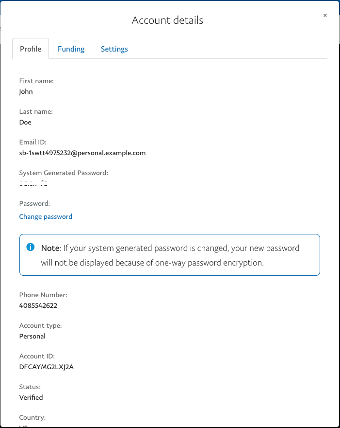
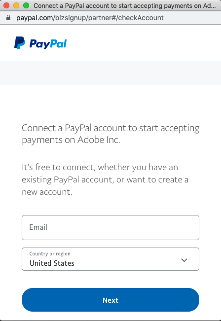

# Configuración del simulador de pruebas

Antes de iniciar la incorporación al simulador de pruebas, debe registrarse en una cuenta gratuita de desarrollador de PayPal y crear cuentas de comerciante (para utilizarlas en la incorporación) y de comprador (para probarlas). Si lo desea, puede crear varias cuentas de desarrollador.

Una cuenta de espacio aislado de PayPal permite usar [!DNL Payment Services] en modo de prueba. PayPal requiere que utilice una cuenta de prueba de Business Sandbox generada por PayPal Developer Portal, un correo electrónico y una contraseña para la incorporación a entornos limitados. *No cree otra cuenta durante el proceso de incorporación al entorno limitado.*

## Incorporación de espacio aislado

Para completar la incorporación al entorno limitado:

1. Vaya a la [Página Cuenta de desarrollador de PayPal](https://developer.paypal.com/developer/accounts/).
1. Haga clic en **[!UICONTROL Log in to Dashboard]** e inicie sesión con su cuenta de prueba de Business Sandbox generada por PayPal Developer Portal o haga clic en **Registrarse** para crear una cuenta.
1. Cree una cuenta de espacio aislado de PayPal:
   1. Vaya a _[!UICONTROL Testing Tools]_>**[!UICONTROL Sandbox Accounts]**.
   1. Haga clic en **[!UICONTROL Create account]**.

      Si ha creado una cuenta de espacio aislado de PayPal durante el proceso de incorporación de PayPal, debe [restablecer el entorno limitado de integración](#reset-your-sandbox-account) porque o no puede verificar su correo electrónico.

   1. Select **[!UICONTROL Business]** como Tipo de cuenta y haga clic en **[!UICONTROL Create]**.
   1. En el _[!UICONTROL Sandbox Accounts]_, haga clic en los tres puntos del_[!UICONTROL Manage accounts]_ para la cuenta de entorno limitado que ha creado.
   1. Haga clic en **[!UICONTROL View/edit account]**.

      

   1. Copie y guarde el ID de correo electrónico y la contraseña generada por el sistema para su uso futuro.

1. En el _Administrador_ barra lateral, vaya a **[!UICONTROL Sales]** > **[!UICONTROL Payment Services]**.
1. Haga clic en **[!UICONTROL Sandbox onboarding]**.

   Esta opción está visible si aún no ha completado la incorporación del entorno limitado para [!DNL Payment Services].

   Un ID de comerciante de simulador de pruebas se genera automáticamente y se rellena en [configuración](settings.md). No cambie ni modifique este ID.

   Se le presenta una ventana de PayPal para conectar una cuenta de PayPal para comenzar a aceptar pagos.

1. Introduzca el correo electrónico y la contraseña de la cuenta de espacio aislado de PayPal que ha generado en el paso 3 (no la información de su cuenta comercial de PayPal) y su país o región.
1. Haga clic en **[!UICONTROL Next]**.

   

1. Continúe siguiendo el flujo de PayPal, utilizando las credenciales de cuenta de espacio aislado guardadas anteriormente.
1. En el _Administrador_ barra lateral, vaya a **[!UICONTROL Sales]** > **[!UICONTROL Payment Services]**.

   La variable **[!UICONTROL Sandbox onboarding]** ya no está visible y aparece el texto &quot;Pagos pendientes de Sandbox&quot;.

Cuando se aprueba la incorporación de su simulador de pruebas PayPal, debería ver una notificación que indica que su sistema de pago está actualmente en modo de simulación de pruebas y no está procesando pagos en directo.

>[!IMPORTANT]
>
>Si revoca el consentimiento a [!DNL Payment Services] para [!DNL Adobe Commerce] y [!DNL Magento Open Source] para procesar sus pagos (en la configuración de su cuenta de PayPal), los pedidos de su tienda no pueden ser procesados por [!DNL Payment Services]. En su página de inicio de Servicios de Pago, aparecerá una alerta sobre el consentimiento revocado. Para rechazar la alerta, haga clic en **[!UICONTROL Do not show again]**.

### Restaurar la cuenta del simulador para pruebas

Si ha creado una cuenta de espacio aislado de PayPal durante el proceso de incorporación de PayPal, debe restablecer el simulador para pruebas de integración porque, de lo contrario, no podrá verificar el correo electrónico.

Para restablecer la cuenta del simulador para pruebas:

1. Haga clic en **[!UICONTROL Reset sandbox]**. [Crear una cuenta de espacio aislado empresarial de PayPal](https://developer.paypal.com/docs/api-basics/sandbox/accounts/#create-a-business-sandbox-account).
1. Haga clic en **[!UICONTROL Sandbox onboarding]** y complete el siguiente conjunto de pasos.

## Habilitar número de teléfono de contacto

El número de teléfono de contacto le permite obtener los números de teléfono de contacto que PayPal recopila de sus clientes. PayPal siempre recopila los números de teléfono de contacto de los titulares de cuentas de PayPal para ayudar a confirmar su identidad y ponerse en contacto con ellos para resolver problemas en sus cuentas, o para completar sus procesos de cumplimiento. Sin embargo, PayPal desaconseja el uso de números de teléfono de contacto directamente del comerciante porque puede afectar negativamente a las ventas. Consulte la [PayPal recibe números de teléfono de contacto](https://developer.paypal.com/docs/admin/checkout-settings/#get-contact-telephone-numbers) documentación para obtener más información.

Esta función es `off` de forma predeterminada. Cuando lo habilita, los administradores de la tienda pueden ver los números de teléfono cuando un cliente completa un flujo de salida de marca fuera de la página de cierre de compra.

>[!IMPORTANT]
>
>Esta configuración no se aplica a otros flujos de cierre de compra.

## Prueba en el entorno de entorno limitado

Consulte [Prueba y validación](test-validate.md) para obtener más información.
