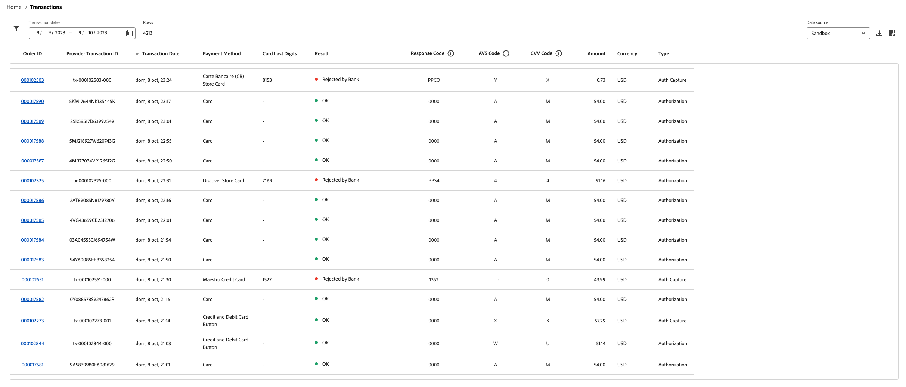

# Informe de transacciones

[!DNL Payment Services] para [!DNL Adobe Commerce] y [!DNL Magento Open Source] le ofrece informes completos para que pueda obtener una visión clara de las transacciones, pedidos y pagos de su tienda.

{width="700" zoomable="yes"}

El informe Transacciones proporciona visibilidad sobre las tasas de autorización de transacciones y las tendencias negativas de las transacciones para que pueda monitorizar de forma eficaz el estado de su tienda e identificar y abordar de forma preventiva cualquier problema de transacción.

Ver transacciones individuales para pedidos realizados en la tienda y sus métodos de pago, resultados, códigos de respuesta de pago, etc.

La información proporcionada en el informe Transacciones está destinada únicamente a uso comercial. No comparta esta información con clientes u otros posibles estafadores. La información de transacciones podría utilizarse para omitir las comprobaciones de seguridad o realizar pedidos que resulten en devoluciones de cargos.

Puede descargar el informe Transacciones en formato de archivo .csv para utilizarlo con el software de contabilidad o de gestión de pedidos existente.

>[!NOTE]
>
>No puede ver informes financieros si no lo ha hecho [Modo en directo incorporado y activado](production.md#enable-live-payments) para [!DNL Payment Services].

## Vista del informe de transacciones

La vista Informe de transacciones está disponible en la vista Transacciones de Servicios de pago. Incluye toda la información disponible sobre las transacciones de tu tienda o tiendas.

En el _Administrador_ barra lateral, vaya a **[!UICONTROL Sales]** > **[!UICONTROL Payment Services]** > _[!UICONTROL Transactions]_>**[!UICONTROL View Report]**para ver la tabla detallada de la vista del informe Transacciones.

{width="600" zoomable="yes"}

Puede configurar esta vista, según las secciones de este tema, para presentar mejor los datos que desee ver.

Consulte ID de transacción de proveedor y pedido de comercio vinculados, importes de transacción, método de pago por transacción y mucho más, todo dentro de este informe.

No todos los métodos de pago proporcionan la misma granularidad de la información. Por ejemplo, las transacciones con tarjeta de crédito proporcionan códigos de respuesta, AVS y CCV, y los últimos cuatro dígitos de la tarjeta en el informe Transacciones; los botones PayPal Smart no.

Puede [descargar transacciones](#download-transactions) en formato de archivo .csv para su uso en software de contabilidad o gestión de pedidos existente.

### Seleccionar fuente de datos

En la vista Informe de transacciones, puede seleccionar el origen de datos—**[!UICONTROL Live]** o **[!UICONTROL Sandbox]**: para el que se desea ver los resultados del informe.

{width="300" zoomable="yes"}

If _[!UICONTROL Live]_es la fuente de datos seleccionada, puede ver información de informes de las tiendas que utilizan [!DNL Payment Services] en modo de producción. If_[!UICONTROL Sandbox]_ es la fuente de datos seleccionada, donde puede ver la información del informe del modo de entorno limitado.

Las selecciones de fuentes de datos funcionan de la siguiente manera:

* Si no tiene ninguna tienda que utilice [!DNL Payment Services] en el modo de producción, la selección de la fuente de datos toma el valor predeterminado _[!UICONTROL Sandbox]_.
* Si tiene tiendas (una o varias) que utilicen [!DNL Payment Services] en el modo de producción, la selección de la fuente de datos toma el valor predeterminado _[!UICONTROL Live]_.
* Las exportaciones de informes siempre respetan la selección de fuente de datos.

Para seleccionar la fuente de datos de su [!UICONTROL Transactions] informe:

1. En el _Administrador_ barra lateral, vaya a **[!UICONTROL Sales]** > **[!UICONTROL [!DNL Payment Services]]** > _[!UICONTROL Transactions]_>**[!UICONTROL View Report]**.
1. Clic **[!UICONTROL Data source]** y seleccione **[!UICONTROL Live]** o **[!UICONTROL Sandbox]**.

   Los resultados del informe se regeneran en función del origen de datos seleccionado.

### Personalizar fechas/periodo

Desde la vista Informe de transacciones, puede personalizar el periodo de tiempo de las transacciones que desea ver seleccionando fechas específicas. De forma predeterminada, se muestran en la cuadrícula 30 días de transacciones.

1. En el _Administrador_ barra lateral, vaya a **[!UICONTROL Sales]** > **[!UICONTROL [!DNL Payment Services]]** > _[!UICONTROL Transactions]_>**[!UICONTROL View Report]**.
1. Haga clic en **[!UICONTROL Transaction dates]** filtro selector de calendario.
1. Seleccione el intervalo de fechas aplicable.
1. Ver las transacciones para las fechas especificadas en la cuadrícula.

### Filtrar información del informe

En la vista Informe de transacciones, puede filtrar los resultados de los estados que desea ver seleccionando criterios de filtro.

1. En el _Administrador_ barra lateral, vaya a **[!UICONTROL Sales]** > **[!UICONTROL [!DNL Payment Services]]** > _[!UICONTROL Transactions]_>**[!UICONTROL View Report]**.
1. Haga clic en **[!UICONTROL Filter]** selector.
1. Alternar el _[!UICONTROL Transaction Result]_opciones para ver los resultados del informe sólo para las transacciones de pedido seleccionadas.
1. Seleccione el _[!UICONTROL Card Type]_para ver los resultados del informe del tipo de tarjeta seleccionado. Se muestra información de objeto adicional cuando el procesador de pagos no puede identificar el tipo de tarjeta.
1. Seleccione el _[!UICONTROL Card Brand]_para ver los resultados de los informes de la marca de tarjeta seleccionada. Se muestra información adicional cuando el procesador de pagos no puede identificar la marca de la tarjeta.
1. Alternar el _[!UICONTROL Payment Method]_opciones para ver los resultados del informe sólo para métodos de pago seleccionados.
1. Introduzca una _Importe de pedido mínimo_ o _Importe máximo del pedido_ para ver los resultados del informe dentro de ese rango de importes de pedidos.
1. Introduzca una _[!UICONTROL Order ID]_para buscar una transacción específica.
1. Introduzca el _[!UICONTROL Card Last Four Digits]_para buscar una tarjeta de crédito o débito específica.
1. Clic **[!UICONTROL Hide filters]** para ocultar el filtro.

### Mostrar y ocultar columnas

El informe Transacciones muestra todas las columnas de información disponibles de forma predeterminada. Sin embargo, puede personalizar qué columnas ve en el informe.

1. En el _Administrador_ barra lateral, vaya a **[!UICONTROL Sales]** > **[!UICONTROL [!DNL Payment Services]]** > _[!UICONTROL Transactions]_>**[!UICONTROL View Report]**.
1. Haga clic en **[!UICONTROL Column settings]** icono {width="20" zoomable="yes"}.
1. Para personalizar las columnas que se ven en el informe, marque o desmarque las columnas de la lista.

   El informe Transacciones muestra inmediatamente los cambios realizados en el menú Configuración de columna. Las preferencias de columna se guardan y se mantienen en vigor si se aleja de la vista Informes.

### Actualización de datos del informe

La vista del informe Transacciones muestra un _[!UICONTROL Last updated]_marca de tiempo que muestra la última vez que se actualizó la información del informe. De forma predeterminada, los datos del informe de transacciones se actualizan automáticamente cada tres horas.

También puede forzar manualmente una actualización de los datos del informe para ver la información del informe más actualizada.

1. En el _Administrador_ barra lateral, vaya a **[!UICONTROL Sales]** > **[!UICONTROL [!DNL Payment Services]]** > _[!UICONTROL Transactions]_>**[!UICONTROL View Report]**.
1. Haga clic en _Actualizar_ icono ({width="20" zoomable="yes"}).

   Se actualizan los datos del informe Transacciones, y *[!UICONTROL Update complete]* aparece una confirmación y la información más reciente está presente en la cuadrícula.

### Descargar transacciones

Puede descargar un archivo .csv con todas las transacciones visibles en la cuadrícula de la vista de transacciones, independientemente de si está viendo los 30 días predeterminados de transacciones o un periodo de tiempo personalizado.

1. En el _Administrador_ barra lateral, vaya a **[!UICONTROL Sales]** > **[!UICONTROL [!DNL Payment Services]]** > **[!UICONTROL Transactions]**.
1. Si desea ver las transacciones de un periodo de tiempo diferente a los últimos 30 días, [personalizar el intervalo de tiempo para los estados](#customize-dates-timeframe).
1. Haga clic en _Descargar_ {width="20" zoomable="yes"} icono.

Las transacciones se descargan en formato .csv.

### Descripciones de columna

Los informes de transacciones incluyen la siguiente información.

| Columna | Descripción |
| ------------ | -------------------- |
| [!UICONTROL Order ID] | ID de pedido de comercio (contiene solo valores para transacciones correctas y está vacío para transacciones rechazadas)   Para ver información relacionada [información del pedido](https://docs.magento.com/user-guide/sales/orders.html){target="_blank"}, haga clic en el ID. |
| [!UICONTROL Provider Transaction ID] | ID de transacción proporcionado por el proveedor de pagos; contiene solo valores para las transacciones correctas y contiene un guión para las transacciones rechazadas. |
| [!UICONTROL Transaction Date] | Marca de fecha y hora de transacción |
| [!UICONTROL Payment Method] | Forma de pago de la transacción con información detallada sobre la marca y el tipo de tarjeta. Consulte [tipos de tarjeta](https://developer.paypal.com/docs/api/orders/v2/#definition-card_type) para obtener más información; disponible para las versiones 1.6.0 y posteriores de Payment Services |
| [!UICONTROL Card Last Four Digits] | Últimos cuatro dígitos de las tarjetas de crédito o débito utilizadas para la transacción |
| [!UICONTROL Result] | El resultado de la transacción—*[!UICONTROL OK]* (transacción correcta), *[!UICONTROL Rejected by Payment Provider]* (rechazado por PayPal), *[!UICONTROL Rejected by Bank]* (rechazado por el banco que emitió la tarjeta) |
| [!UICONTROL Response Code] | Código de error que proporciona un motivo de rechazo del proveedor de pagos o del banco; consulte la lista de posibles códigos de respuesta y descripciones para [`Rejected by Bank` status](https://developer.paypal.com/docs/api/orders/v2/#definition-processor_response) y [`Rejected by Payment Provider` status](https://developer.paypal.com/api/rest/reference/orders/v2/errors/). |
| [!UICONTROL AVS Code] | Código de servicio de verificación de direcciones; la información de respuesta del procesador para las solicitudes de pago. Consulte [lista de posibles códigos y descripciones](https://developer.paypal.com/docs/api/orders/v2/#definition-processor_response) para obtener más información. |
| [!UICONTROL CVV Code] | Código de valor de verificación de tarjeta para tarjetas de crédito y débito; consulte [lista de posibles códigos y descripciones](https://developer.paypal.com/docs/api/orders/v2/#definition-processor_response) para obtener más información. |
| [!UICONTROL Amount] | Importe del pedido de la transacción |
| [!UICONTROL Currency] | Divisa utilizada para el pedido en la transacción |
| [!UICONTROL Type] | [Acción de pago](../payment-services/production.md#set-payment-services-as-payment-method) para la transacción—`Authorize` o `Authorize and Capture` |

### Códigos de respuesta de error

El _Código de respuesta_ La columna muestra un error específico o un código de éxito relacionado con la transacción. Algunos códigos de error comunes que puede ver en pantalla son:

* `PAYMENT_DENIED`—PayPal rechazó la transacción porque se sospechaba que era fraudulenta.
* `INTERNAL_SERVER_ERROR`—PayPal rechazó la transacción y se produjo un error en el servidor de PayPal. Se puede volver a intentar la transacción.
* `INSTRUMENT_DECLINED`—PayPal rechazó el cliente por el método de pago seleccionado. La transacción se puede reintentar con un método de pago diferente.
* `9500`—El banco asociado rechazó la transacción porque se sospechaba que era fraudulenta.
* `5120`—El banco asociado rechazó la transacción porque el cliente no tenía fondos suficientes para el pago.
* `5650`—El banco asociado rechazó la transacción porque el banco requiere una autenticación sólida del cliente ([3DS](security.md#3ds)).

Los códigos de respuesta de error detallados para transacciones fallidas están disponibles para transacciones posteriores al 1 de junio de 2023. Los datos de informe parciales aparecerán para las transacciones que se produjeron antes del 1 de junio de 2023.
