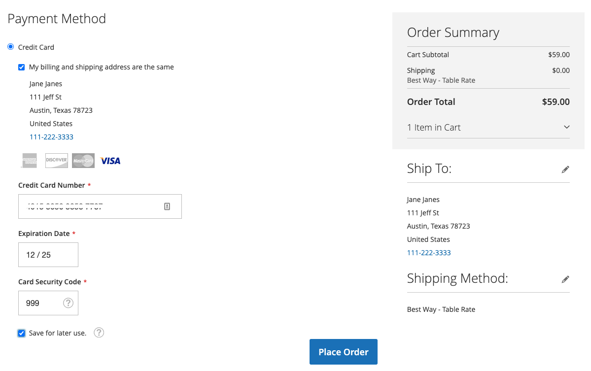

# Bóveda de tarjetas de crédito

Convierta a los clientes únicos en compradores fieles con bóvedas de tarjetas de crédito. Los compradores pueden guardar (o &quot;bóveda&quot;) sus credenciales de tarjeta de crédito durante el cierre de compra para usarlas en una compra posterior para la misma cuenta o para otra tienda dentro de la misma cuenta de comerciante.

Los compradores utilizan el token almacenado para realizar un cierre de compra futuro con la información guardada de su tarjeta de crédito.

También pueden eliminar fácilmente sus tarjetas de crédito abovedadas de [Métodos de pago almacenados](https://docs.magento.com/user-guide/customers/account-dashboard-stored-payment-methods.html) en su Mi cuenta.

## Habilitar bóveda

Puede habilitar la bóveda de tarjetas de crédito para sus tiendas en Servicios de Pago [Configuración](settings.md#card-vaulting).

## Seguridad

La información mínima de la tarjeta de crédito se comparte con el comprador; solo ven los cuatro últimos dígitos, la fecha de caducidad y la marca de su tarjeta de crédito abovedada. La información de la tarjeta de crédito se almacena con el proveedor de pagos para satisfacer [PCI](security.md#PCI-compliance) estándares de cumplimiento.
