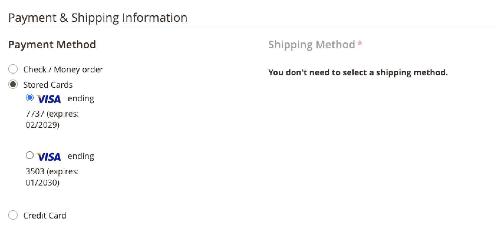

# Bóveda de tarjeta de crédito

Convierta a los clientes únicos en compradores fieles con depósito de tarjetas de crédito. Los compradores pueden guardar (o &quot;guardar&quot;) las credenciales de su tarjeta de crédito durante el cierre de compra para usarlas en una compra posterior para la misma tienda, u otra, dentro de la misma cuenta de comerciante.

Los compradores utilizan el token almacenado para completar un pago futuro con la información de su tarjeta de crédito guardada.

También pueden eliminar fácilmente sus tarjetas de crédito abovedadas de [Métodos de pago almacenados](https://docs.magento.com/user-guide/customers/account-dashboard-stored-payment-methods.html) en Mi cuenta.

## Activar almacenamiento en depósito

Puede habilitar el depósito de tarjetas de crédito para los clientes _y_ comerciantes en el Administrador, para sus tiendas en [!DNL Payment Services] [Configuración](settings.md#card-vaulting).

## Uso del Vault en la administración

Si un cliente tiene una tarjeta de crédito previamente seleccionada, un comerciante puede crear un pedido posterior para ese cliente en el administrador utilizando sus métodos de pago abovedados.

Solo puede utilizar tarjetas abovedadas en el administrador si el cliente tiene una cuenta existente y un token válido almacenado en el sistema a partir de un pago completado anteriormente.

Para crear un pedido en Admin para un cliente con su tarjeta de crédito:

1. [Crear un pedido y añadir productos](https://experienceleague.adobe.com/docs/commerce-admin/stores-sales/point-of-purchase/assist/customer-account-create-order.html).
1. Entrada _[!UICONTROL Payment & Shipping Information]_, seleccione **[!UICONTROL Stored Cards]**como forma de pago.
1. Seleccione el método de pago de tarjeta de crédito abovedado que desee.
1. Después de completar cualquier otro paso necesario para el pedido, [enviarlo](https://experienceleague.adobe.com/docs/commerce-admin/stores-sales/point-of-purchase/assist/customer-account-create-order.html?lang=en#step-3%3A-submit-the-order).

   

## Seguridad

La información mínima de la tarjeta de crédito se comparte con el comprador; solo ve los últimos cuatro dígitos, la fecha de caducidad y la marca de su tarjeta de crédito abovedada. La información de la tarjeta de crédito se almacena con el proveedor de pagos para satisfacer [PCI](security.md#PCI-compliance) normas de conformidad.
