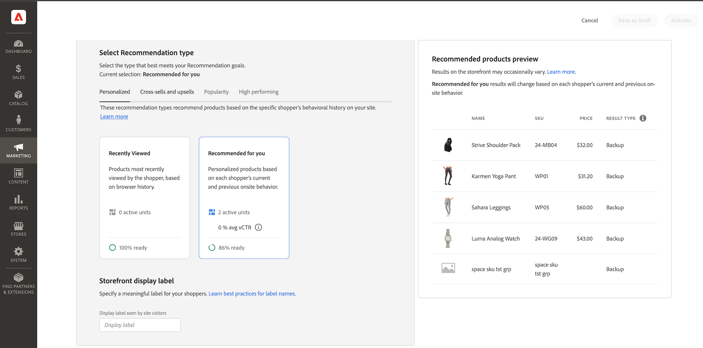

# Crear nueva recomendación

Cuando crea una recomendación, crea una _unidad de recomendación_ que contiene el producto recomendado _items_.

_Unidad de recomendación_

Al activar la unidad de recomendación, Adobe Commerce empieza a [recopilar datos](workspace.md) para medir impresiones, vistas, clics, etc. La variable [!DNL Product Recommendations] muestra las métricas de cada unidad de recomendación para ayudarle a tomar decisiones comerciales informadas.

1. En el _Administrador_ barra lateral, vaya a **Marketing** > _Promociones_ > **Recommendations de producto** para mostrar el _Recommendations de producto_ espacio de trabajo.

1. Especifique la variable [Vista de la tienda](https://docs.magento.com/user-guide/configuration/scope.html) donde desea que se muestren las recomendaciones.

   >[!NOTE]
   >
   > Las unidades de recomendación del Generador de páginas solo se pueden crear para la vista de tienda predeterminada. Para obtener más información sobre la creación de recomendaciones de productos con Page Builder, consulte [Añadir contenido: Recommendations de producto](https://docs.magento.com/user-guide/cms/page-builder-add-recommendations.html).

1. Haga clic en **Crear recomendación**.

1. En el _Asigne un nombre a la recomendación_ , introduzca un nombre descriptivo para la referencia interna, como `Home page most popular`.

1. En el _Seleccionar tipo de página_ seleccione la página en la que desea que aparezca la recomendación entre las siguientes opciones:

   - Página principal
   - Categoría
   - Detalles del producto
   - Carro de compras
   - Confirmación
   - [Page Builder](https://docs.magento.com/user-guide/cms/page-builder-add-recommendations.html)

   Puede crear hasta cinco unidades de recomendación activas por cada tipo de página y hasta 25 unidades para el Creador de páginas. El tipo de página aparece atenuado Cuando se alcanza el límite.

   
   _Nombre y ubicación de la recomendación_

1. En el _Seleccionar tipo de recomendación_ especifique la [tipo de recomendación](type.md) desea que aparezca en la página seleccionada. Para algunas páginas, la variable [placement](placement.md) de recomendaciones se limita a ciertos tipos.

1. En el _Etiqueta de visualización de tienda_ , introduzca el [label](placement.md#recommendation-labels) que son visibles para sus compradores, como &quot;Principales vendedores&quot;.

   
   _Tipo de recomendación_

1. En el _Elija el número de productos_ , utilice el control deslizante para especificar cuántos productos desea que aparezcan en la unidad de recomendaciones.

   El valor predeterminado es `5`, con un máximo de `20`.

1. En el _Seleccionar ubicación_ , especifique la ubicación en la que aparecerá la unidad de recomendación en la página.

   - En la parte inferior del contenido principal
   - En la parte superior del contenido principal

1. (Opcional) Para cambiar el orden de las recomendaciones, seleccione y mueva las filas en la _Elegir posición_ tabla.

   La variable _Elegir posición_ muestra todas las recomendaciones (si las hay) creadas para el tipo de página seleccionado.

   
   _Tipo de recomendación_

1. (Opcional) En la _Filtros_ sección, [aplicar filtros](filters.md) para controlar qué productos aparecen en la unidad de recomendaciones.

   
   _Filtros de producto de recomendación_

1. Cuando termine, haga clic en una de las siguientes opciones:

   - **Guardar como borrador** para editar la unidad de recomendación más adelante. No se puede modificar el tipo de página o el tipo de recomendación de una unidad de recomendación en estado borrador.

   - **Activar** para habilitar la unidad de recomendación en la tienda.

## Vista previa de Recommendations {#preview}

La variable _Vista previa de productos recomendados_ siempre está disponible con una selección de productos de muestra que podría aparecer en la unidad de recomendación cuando se implemente en la tienda.

Para probar una recomendación cuando se trabaja en un entorno que no es de producción, puede recuperar los datos de recomendación de un [fuente diferente](settings.md). Esto permite a los comerciantes experimentar con las reglas y obtener una vista previa de las recomendaciones antes de implementarlas en producción.

| Campo | Descripción |
|---|---|
| Nombre | Nombre del producto. |
| SKU | La unidad de mantenimiento de existencias asignada al producto |
| Precio | El precio del producto. |
| Tipo de resultado | Principal : indica que se han recopilado suficientes datos de capacitación para mostrar una recomendación. Copia de seguridad: indica que no hay suficientes datos de capacitación recopilados, por lo que se utiliza una recomendación de copia de seguridad para llenar la ranura. Vaya a [Datos de comportamiento](behavioral-data.md) para obtener más información sobre modelos de aprendizaje automático y recomendaciones de copia de seguridad. |

A medida que crea la unidad de recomendaciones, experimente con el tipo de página, el tipo de recomendación y los filtros para obtener información inmediata en tiempo real sobre los productos que se incluirán. A medida que empiece a comprender qué productos aparecen, puede configurar la unidad de recomendaciones para satisfacer sus necesidades comerciales.

Adobe Commerce [filtros](filters.md) recomendaciones para evitar mostrar productos duplicados cuando se implementan varias unidades de recomendación en una sola página. Como resultado, los productos que aparecen en el panel de vista previa pueden diferir de los que aparecen en la tienda.

>[!NOTE]
>
> No puede obtener una vista previa del `Recently viewed` tipo de recomendación porque los datos no están disponibles en el Administrador.
