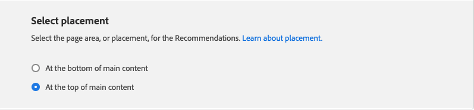

# Editar recomendación

La página Editar recomendación permite ajustar la configuración individual que compone la recomendación. Todos los ajustes se pueden editar excepto el tipo de página y el tipo de recomendación. Se pueden editar las siguientes opciones de configuración:

- [Nombre de recomendación](#name)
- [Etiqueta de tienda](#label)
- [Número de productos](#number)
- [Ubicación y posición](#placement)
- [Filtrar productos](#filters)

La vista previa en la parte derecha de la página muestra cómo puede aparecer la recomendación con la configuración actual en la tienda. El _Previsualización de productos recomendados_ permanece visible como referencia a medida que se desplaza hacia abajo por la página. La vista previa muestra una imagen en miniatura del producto, el nombre del producto, el SKU, el precio y el tipo de resultado de cada producto devuelto. El tipo de resultado indica si hay suficientes datos de comportamiento primarios para generar la recomendación o si está utilizando datos de comportamiento de copia de seguridad.

## Editar una recomendación

1. En el _Administrador_ barra lateral, vaya a **Marketing** > _Promociones_ > **Product Recommendations**.

1. Seleccione la recomendación que desee editar.

1. Clic **Editar**. A continuación, siga las instrucciones que se indican a continuación para realizar los cambios que necesite.

1. Cuando termine, haga clic en **Guardar cambios**.

### Nombre de recomendación {#name}

Elija un nombre descriptivo que indique el propósito de la recomendación. El nombre es para referencia interna y no aparece en la tienda.

### Etiqueta de tienda {#label}

Escriba el texto que desee usar como etiqueta para la unidad de recomendación en la tienda.

### Número de productos {#number}

Ajuste el control deslizante para mostrar hasta 20 productos en la unidad de recomendación.

### Ubicación y posición {#placement}

1. Elija la ubicación de la página donde aparecerá la unidad de recomendación en la tienda.

   - Al final del contenido principal
   - Al principio del contenido principal

   

1. Para cambiar el orden de las recomendaciones incluidas en la unidad, utilice el **Mover**  para arrastrar las recomendaciones a su posición.

   

### Filtrar productos {#filters}

Cualquier cambio realizado en el producto [filtros](filters.md) se reflejan en la _Previsualización de productos recomendados_. Solo se permite recomendar productos que coincidan con los filtros de inclusión. No se recomiendan los productos que coinciden con cualquier filtro de exclusión.

El _Inclusiones_ y _Exclusiones_ las pestañas enumeran los filtros disponibles de cada tipo. En la lista, cada filtro activo se marca con un punto azul.

- Para mostrar los detalles de cada filtro, haga clic en su nombre.
- Para cambiar el estado del filtro, establezca el **Activar filtro** alternar a `on` o `off` posición.

La configuración del filtro describe los productos que se van a incluir o excluir en la unidad de recomendación. Por ejemplo, la variable _Categoría_ la configuración de inclusión de filtros indica al sistema que incluya solo los productos de las categorías seleccionadas.

