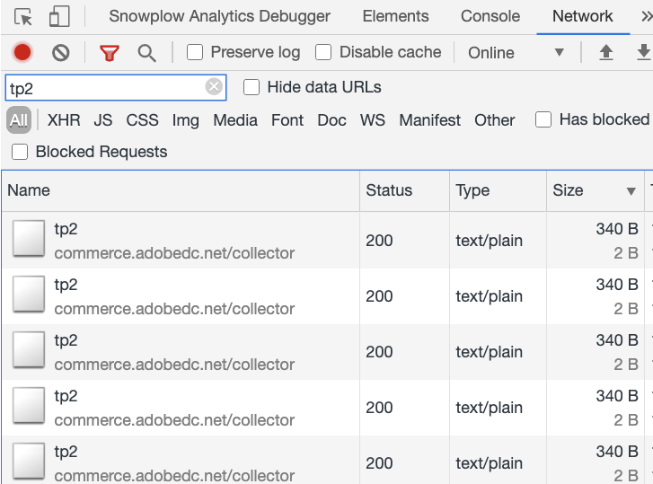

# Comprobar colección de eventos

Tras [instalar y configurar](install-configure.md) el `magento/product-recommendations` , puede comprobar que los datos de comportamiento se envían a Adobe Commerce. Puede utilizar las herramientas para desarrolladores disponibles en Chrome o instalar la extensión de Snowplow Chrome. Si necesita ayuda adicional, consulte [Resolución de problemas [!DNL Product Recommendations] módulo](https://support.magento.com/hc/en-us/articles/360042224851) en la Base de conocimientos de soporte.

## Verificar con las herramientas para desarrolladores en Chrome

Para asegurarse de que el archivo JS del recopilador de eventos se está cargando en todas las páginas del sitio:

1. En Chrome, elija **Personalización y control de Google Chrome** a continuación, seleccione **Más herramientas** > **Herramientas para desarrolladores**.
1. Elija la **Red** a continuación, seleccione **JS** tipo .
1. Filtrar por `ds.`
1. Vuelva a cargar la página.
1. Debería ver `ds.js` o `ds.min.js` en el **Nombre** para abrir el Navegador.

_JS del recopilador de eventos_

Para garantizar que los eventos se activen en páginas de su sitio (inicio, producto, cierre de compra, etc.):

1. Asegúrese de desactivar los bloqueadores de publicidad en el explorador y de aceptar las cookies en el sitio.
1. En Chrome, elija **Personalización y control de Google Chrome** (los tres puntos verticales de la esquina superior derecha del explorador) y, a continuación, seleccione **Más herramientas** > **Herramientas para desarrolladores**.
1. Elija la **Red** pestaña y filtrar por `tp2`.
1. Vuelva a cargar la página.
1. Debería ver las llamadas en `tp2` en el **Nombre** para abrir el Navegador.

_Verifique que se estén activando eventos_

## Comprobación con la extensión de Snowplow Chrome

Instale el [Extensión de Snowplow Analytics Debugger para Chrome](https://chrome.google.com/webstore/detail/snowplow-analytics-debugg/jbnlcgeengmijcghameodeaenefieedm). Esta extensión muestra los eventos que se recopilan y envían a Adobe Commerce.

1. Asegúrese de desactivar los bloqueadores de publicidad en el explorador y de aceptar las cookies en el sitio.

1. En Chrome, elija **Personalización y control de Google Chrome** (los tres puntos verticales de la esquina superior derecha del explorador) y, a continuación, seleccione **Más herramientas** > **Herramientas para desarrolladores**.

1. Elija la **Snowplow Analytics Debugger** pestaña .

1. En el **Evento** , seleccione **Evento estructurado**.

1. Desplácese hacia abajo hasta que vea **Datos de contexto _n_**. Busque la instancia de tienda en la **Esquema**.

1. Compruebe que la variable [ID del espacio de datos SaaS](https://experienceleague.adobe.com/docs/commerce-admin/config/services/saas.html) está configurado correctamente.

_Filtro Snowplow_

>[!NOTE]
>
> Un valor de `Data validity : NOT FOUND` en debugger indica un esquema interno. El complemento de Snowplow Chrome no puede validar los eventos con un esquema interno. Esto no afecta a la funcionalidad real.

## Compruebe que los eventos se activan correctamente

Para comprobar que los eventos utilizados para las métricas se activan correctamente, busque la variable `impression-render`, `view`y `rec-click` en Snowplow Analytics Debugger. Consulte la [lista completa de eventos](https://experienceleague.adobe.com/docs/commerce-merchant-services/product-recommendations/developer/events.html).

>[!NOTE]
>
> If [Modo de restricción de cookies](https://experienceleague.adobe.com/docs/commerce-admin/start/compliance/privacy/compliance-cookie-law.html) está activada, Adobe Commerce no recopila datos de comportamiento hasta que el comprador consienta. Si el modo de restricción de cookies está desactivado, los datos de comportamiento se recopilan de forma predeterminada.
