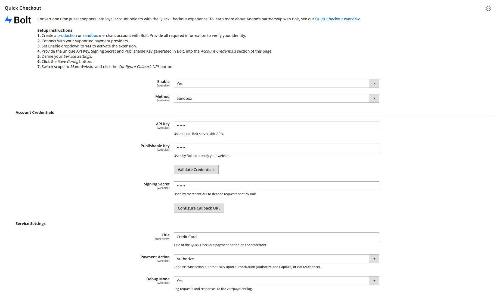

# [!DNL Quick Checkout] Incorporación

Para empezar a usar la variable [!DNL Quick Checkout] para la extensión de Adobe Commerce, debe completar algunos pasos de incorporación para conectar su instancia con nuestra funcionalidad de cierre de compra.

1. [Obtener extensión](#get-extension).
1. [Cree una cuenta de comercialización de producción o de simulación de pruebas con [!DNL Bolt]](#create-account-with-bolt). Proporcione toda la información necesaria para verificar su identidad.
1. [Proporcione la variable única [!DNL API Key] y [!DNL Publishable Key]](#obtain-api-credentials) generado en [!DNL Bolt].
1. [Configure un proveedor de pagos en la variable [!DNL Bolt] account](#configure-payment-providers).
1. [Establezca Habilitar menú desplegable en Sí](#enable-extension) para activar la extensión.
1. [Definir la configuración del servicio](#complete-admin-configuration) para configurar la variable [!DNL Quick Checkout] extensión.
1. [Haga clic en Guardar configuración .](#enable-live-quick-checkout) para activar la extensión.
1. Cambiar ámbito a **Sitio web principal** y [haga clic en Configurar URL de devolución de llamada](#check-shopper-valid-account) botón.

Si Gainsight está habilitada, se déclencheur el **Haga el recorrido** en su [!DNL Quick Checkout] Panel de administración acerca de [!DNL Quick Checkout] para Adobe Commerce:

1. En el _Administrador_ barra lateral, vaya a **[!UICONTROL Stores]** > **[!UICONTROL Configuration]** > Avanzado:

   

Si Gainsight no está habilitada, continúe con los pasos de incorporación.

Consulte la [[!DNL Quick Checkout] Panel de administración](../quick-checkout/admin-panel.md) para obtener más información.

>[!NOTE]
>
> Si no configura su [!DNL Bolt] no puede configurar entornos de simulación de pruebas o de producción.

## Requisitos previos

Para usar la variable [!DNL Quick Checkout], debe tener lo siguiente disponible para [!DNL Bolt]:

- Proveedores de pagos admitidos
- Cuenta de comercialización y producción en [!DNL Bolt]
- API y [!DNL Publishable key] generado en [!DNL Bolt]

Consulte la [requisitos previos](../quick-checkout/prerequisites.md) para obtener más información.

Consulte [Credenciales de API](#obtain-api-credentials) para aprender a crear o acceder a su [!DNL API keys] para su instancia.

## Obtener extensión

Consulte la [instalar](../quick-checkout/install.md) para obtener información detallada sobre la obtención de la extensión.

## Crear cuenta con [!DNL Bolt]

Antes de configurar la variable [!DNL Quick Checkout] en el administrador de Adobe Commerce, es necesario crear un [entorno limitado](https://merchant-sandbox.bolt.com/register?platform=magento2){target="_blank"} and [production](https://merchant.bolt.com/register?platform=magento2){target="_blank"}  cuentas comerciales en [!DNL Bolt]. Proporcione todos los detalles necesarios para crear una cuenta en [!DNL Bolt].

Consulte la [probar y validar](../quick-checkout/testing.md) para obtener más información.

## Obtener credenciales de API

Para usar la variable [!DNL Quick Checkout] necesita [!DNL Bolt] claves únicas y [!DNL signing secret]. Obtenga lo siguiente [!DNL API keys] navegando a **Desarrolladores** > **API** > **Claves** en el **Panel de comercialización del perno**.

- [!DNL API key]: Una clave privada utilizada por el back end para interactuar con [!DNL Bolt] API.
- [!DNL Publishable key]: Una clave utilizada por el front-end para interactuar con [!DNL Bolt] API.
- [!DNL Signing secret]: Se utiliza para la verificación de la firma en las solicitudes recibidas de [!DNL Bolt].

   

Consulte la [[!DNL Bolt] detalles del entorno](https://help.bolt.com/developers/references/environment-details/#about-keys){target="_blank"} para obtener más información sobre las claves y firmar el secreto de [!DNL Bolt] para el [!DNL Quick Checkout] extensión.

>[!CAUTION]
>
> Debe crear [!DNL API keys] para entornos de simulación de pruebas y de producción.

## Configuración de proveedores de pagos

Para conectar a su proveedor de servicios de pago, siga los pasos descritos en la sección [configuración del procesador](https://help.bolt.com/integrations/adobe-quick-checkout/set-up/){target="_blank"} desarrollador [!DNL Bolt] página.

## Habilitar extensión

1. En el _Administrador_ barra lateral, vaya a **Almacenes** > _Configuración_ > **Configuración**.
1. En el panel izquierdo, expanda **Ventas** y seleccione **Cierre de compra**.
1. En el [!DNL Quick Checkout] vista, conjunto **Habilitar** a `Yes`.

>[!CAUTION]
>
> Los campos de cierre de compra rápido solo están visibles cuando **Habilitar** está configurado como `Yes`.

1. Seleccione el método (Simulador para pruebas o Producción) que desea utilizar.

   - Simulador para pruebas y desarrollo
   - Producción para procesar transacciones con el procesador de pagos activos

1. Valide las credenciales después de proporcionar su API única y [!DNL Publishable keys].

Consulte la [Configuración](../quick-checkout/settings-quick-checkout.md) para obtener más información sobre las opciones de configuración de la variable [!DNL Quick Checkout] para la extensión de Adobe Commerce.

>[!CAUTION]
>
> Debe proporcionar una API única y [!DNL Publishable] antes de activar la extensión; de lo contrario, los clientes verán un formulario de pago y no podrán realizar un pedido.

## Completar la configuración de administración

1. En el _Administrador_ barra lateral, vaya a **Almacenes** > **Configuración** > **Cierre de compra** para acceder a la página de configuración general del administrador de cierre de compra .
1. En el _Configuración del servicio_ , proporcione todos los detalles necesarios para habilitar la extensión.
1. Establezca _Acción de pago_ a cualquiera de las opciones:

   - `Authorize`: No capturar la transacción automáticamente tras la autorización.
   - `Authorize and Capture`: Capturar la transacción automáticamente tras la autorización.

Para obtener más información sobre las opciones de cierre de compra estándar de Adobe Commerce, consulte la [cierre de compra](https://docs.magento.com/user-guide/configuration/sales/checkout.html) tema.

## Habilitar el cierre de compra rápido activo

Para habilitar la variable [!DNL Quick Checkout] para la extensión de Adobe Commerce:

1. Compruebe que la variable [!UICONTROL Enable] lista desplegable está configurada como **Sí** para activar la extensión.
1. Haga clic en **Guardar configuración**.

## Comprobar cuenta válida del comprador

Para comprobar si el comprador tiene un [!DNL Bolt] cuenta:

1. Cambie el ámbito a **Sitio web principal**.
1. Haga clic en el **Configurar URL de devolución de llamada** botón. Esto habilita [!DNL Bolt] para determinar si el comprador tiene una cuenta. Si lo hacen, aparecerá la ventana emergente de OTP.

   >[!CAUTION]
   >
   > Cambiar el ámbito a la variable **Sitio web principal** garantiza que se establezca la dirección URL adecuada. Cada sitio web puede tener varios dominios.

Consulte la [Ámbito de sitio, tienda y vista](https://experienceleague.adobe.com/docs/commerce-admin/start/setup/websites-stores-views.html#scope-settings){target="_blank"} para obtener más información sobre los ámbitos en Adobe Commerce.

## Configuración de servicios

1. Establezca **Habilitar el seguimiento de cierre de compra** a `Yes`.

   >[!CAUTION]
   >
   > Deshabilitar esta opción afectará a los informes, ya que Adobe Commerce no puede compartir información de seguimiento de cierre de compra con Bolt.

1. Seleccione el **Siguiente etapa después del inicio de sesión** para cambiar el flujo de navegación después de que el cliente haya iniciado sesión. De forma predeterminada, se establece en la variable **Pagos** página.
1. Defina si [!DNL Quick Checkout] permite que **inicio de sesión automático** durante el cierre de compra. De forma predeterminada, está habilitado para iniciar sesión automáticamente en el [!DNL Bolt] red.

   >[!NOTE]
   >
   > Consulte [Documentación de activación de inicio de sesión automático de Bolt](https://help.bolt.com/products/embedded/direct-api/auto-login/) para obtener más información.

## Obtener ayuda

El proceso de incorporación está diseñado para guiarle por los pasos necesarios para configurar y habilitar el [!DNL Express Checkout] funcionalidad.

Póngase en contacto con el servicio de asistencia de Adobe Commerce a través de la [Centro de ayuda de Adobe Commerce](https://experienceleague.adobe.com/docs/commerce-knowledge-base/kb/help-center-guide/magento-help-center-user-guide.html) para cualquier ayuda.

Consulte la [probar y validar](../quick-checkout/testing.md) para obtener más información.
