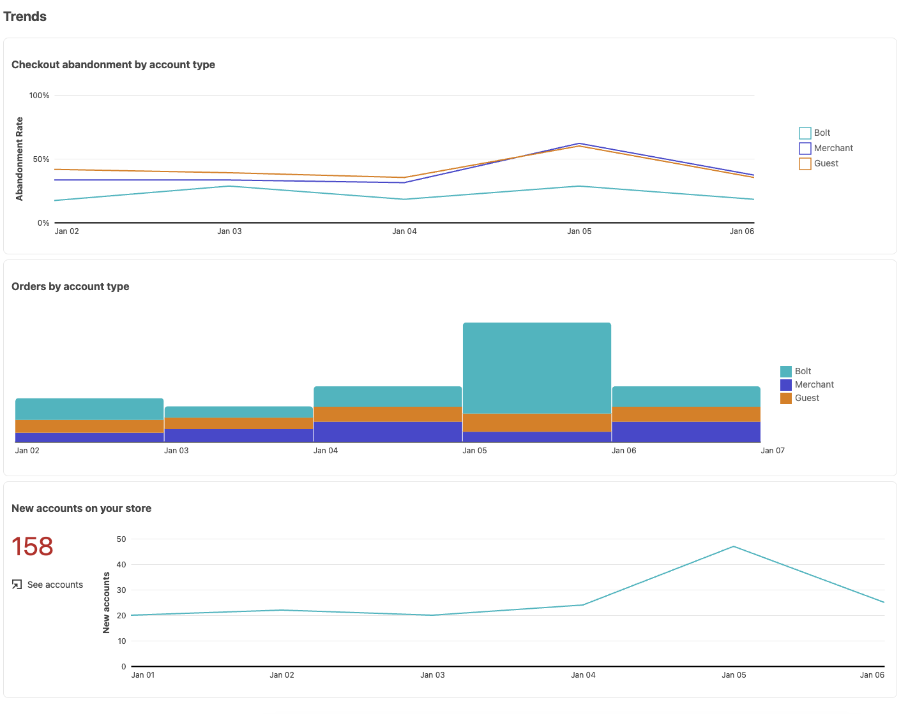

# Informes

[!DNL Quick Checkout] para Adobe Commerce y Magento Open Source ofrece informes completos para que pueda obtener información detallada de las estadísticas de experiencia de cierre de compra de su tienda.

>[!WARNING]
>
> Para permitir que Adobe Commerce comparta información de cierre de compra con Bolt, la variable [**Seguimiento de cierre de compra**](../quick-checkout/settings-quick-checkout.md)  La configuración debe activarse en Admin. De forma predeterminada, esta opción de configuración está configurada en **Sí**. Si esta opción se establece en **No**, la creación de informes se verá afectada. Bolt actualiza la información de los informes una vez al día a las 03:00 a. m., hora estándar del Este (EST).

## Informes de información general

Los gráficos de la sección Información general muestran información detallada sobre el rendimiento de cierre de compra de su tienda, incluido el tiempo promedio de cierre de compra, las nuevas cuentas creadas durante el cierre de compra o el abandono de cierre de compra.

| Gráfico | Descripción |
|---|---|
| [!UICONTROL Checkout abandonment] | El porcentaje de visitantes que abandonan el proceso de cierre de compra sin completar una compra. |
| [!UICONTROL Checkout abandonment breakdown] | El abandono de cierre de compra dividido por tipo de visitante. La información sobre herramientas muestra una diferencia porcentual entre Perno e Invitado. Opciones: [!UICONTROL Bolt] / [!UICONTROL Merchant] / [!UICONTROL Guest] |
| [!UICONTROL Average checkout time] | Tiempo promedio que un visitante tarda en completar el proceso de cierre de compra. |
| [!UICONTROL Average checkout time breakdown] | Tiempo promedio de cierre de compra dividido por tipo de visitante. La información sobre herramientas muestra una diferencia porcentual entre Perno e Invitado. Opciones: [!UICONTROL Bolt] / [!UICONTROL Merchant] / [!UICONTROL Guest] |
| [!UICONTROL Orders by account type] | Pedidos realizados divididos por tipo de visitante. Opciones: [!UICONTROL Bolt] / [!UICONTROL Merchant] / [!UICONTROL Guest] |

## Informes de tendencias

Los gráficos de la sección Tendencias muestran las tendencias de la experiencia de cierre de compra filtradas por tipo de cuenta o por las nuevas cuentas creadas durante el cierre de compra.

| Gráfico | Descripción |
|---|---|
| [!UICONTROL Checkout abandonment by account type] | La tendencia de abandono de compra dividida por tipo de visitante. Opciones: [!UICONTROL Bolt] / [!UICONTROL Merchant] / [!UICONTROL Guest] |
| [!UICONTROL Orders by account type] | Tendencia de pedidos realizados dividida por tipo de visitante. Opciones: [!UICONTROL Bolt] / [!UICONTROL Merchant] / [!UICONTROL Guest] |
| [!UICONTROL New accounts on your store] | Nuevas cuentas en la tendencia de tu tienda. |

## Filtrado de datos

Puede filtrar los resultados mostrados por fecha o por ajustes preestablecidos existentes, como **Últimos 30 días**.

| Campo | Descripción |
|---|---|
| [!UICONTROL Preset] | Lista desplegable que muestra los ajustes preestablecidos predeterminados que se pueden utilizar para mostrar intervalos específicos de datos. De forma predeterminada: Últimos 30 días |
| [!UICONTROL Date range] | Menú desplegable que permite seleccionar un rango de datos específico en función de las fechas seleccionadas. |
