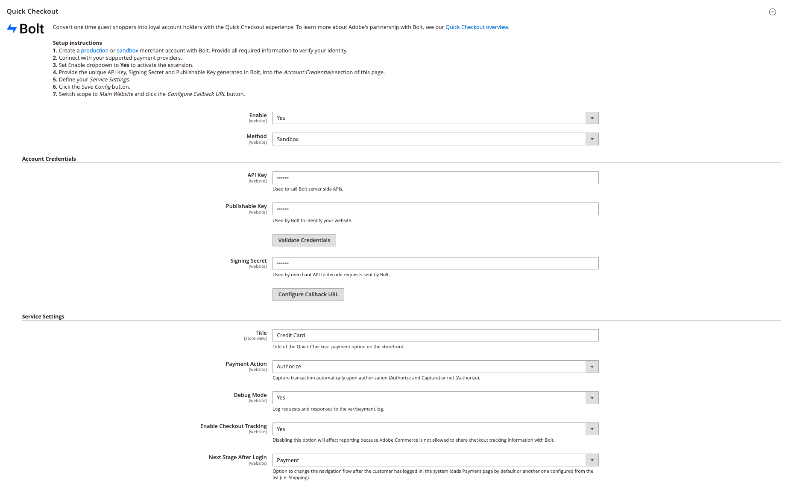

# [!DNL Quick Checkout] configuración

[!DNL Quick Checkout] para Adobe Commerce y Magento Open Source proporciona una vista de configuración con toda la información necesaria para configurar la extensión.

Para acceder a estos ajustes de configuración:

1. En el _Administrador_ barra lateral, vaya a **Almacenes** > _Configuración_ > **Configuración**.
1. En el panel izquierdo, expanda **Ventas** y seleccione **Cierre de compra**.

   

Consulte la [Incorporación](../quick-checkout/onboarding.md) para obtener más información sobre cómo configurar la variable [!DNL Quick Checkout] para Adobe Commerce.

## Habilitar extensión

| Campo | Ámbito | Descripción |
|---|---|---|
| [!UICONTROL Enable] | sitio web | Habilitar o deshabilitar [!DNL Quick Checkout] para su sitio web. Opciones: [!UICONTROL Yes] / [!UICONTROL No] |
| [!UICONTROL Method] | sitio web | Defina el método o el entorno para su [!DNL Quick Checkout]. Opciones: [!UICONTROL Sandbox] / [!UICONTROL Production] |

{style=&quot;table-layout:auto&quot;}

## Credenciales de cuenta

| Campo | Ámbito | Descripción |
|---|---|---|
| [!UICONTROL API key] | sitio web | Una clave privada utilizada por el back end para interactuar con [!DNL Bolt] API. |
| [!UICONTROL Publishable key] | sitio web | Una clave utilizada por el front-end para interactuar con [!DNL Bolt] API. |
| [!UICONTROL Signing secret] | sitio web | Se utiliza para la verificación de la firma en las solicitudes recibidas de [!DNL Bolt]. |

{style=&quot;table-layout:auto&quot;}

## Configuración del servicio

| Campo | Ámbito | Descripción |
|---|---|---|
| [!UICONTROL Title] | vista de tienda | Agregue el texto para mostrarlo como el título de esta opción de pago en la vista Método de pago durante el cierre de compra. Opciones: [!UICONTROL text field] |
| [!UICONTROL Payment Action] | sitio web | La variable [acción de pago](https://docs.magento.com/user-guide/configuration/sales/payment-methods.html#payment-actions){target=&quot;_blank&quot;} para el método de pago especificado. Opciones: [!UICONTROL Authorize] / [!UICONTROL Authorize and Capture] |
| [!UICONTROL Debug Mode] | sitio web | Habilite o deshabilite el modo de depuración. Opciones: [!UICONTROL Yes] / [!UICONTROL No] |
| [!UICONTROL Enable checkout tracking] | sitio web | Defina si Adobe Commerce permite compartir la información de seguimiento de cierre de compra con Bolt. Habilitado de forma predeterminada. Si se deshabilita, los informes se verán afectados. Opciones: [!UICONTROL Yes] / [!UICONTROL No] |
| [!UICONTROL Next Stage After Login Mode] | sitio web | Cambiar el flujo de navegación después de que el cliente haya iniciado sesión. Opciones: [!UICONTROL Payment] / [!UICONTROL Shipping] |

{style=&quot;table-layout:auto&quot;}
